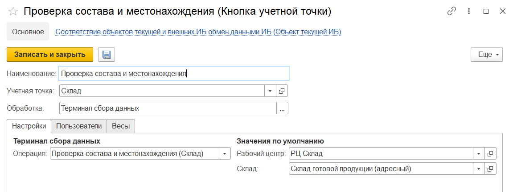

# Создание и настройка кнопки "Проверка состава и местонахождения"

Кнопка **"Проверка состава и местонахождения"** применяется для проверки остатков в ячейке и для определения состава упак. листа и его местонахождения.

При создании кнопки учетной точки **"Проверка состава и местонахождения"** указываются:

- Наименование
- Учетная точка
- Обработка -Терминал сбора данных

На вкладке **"Настройки"** заполняются:

- Операция - Проверка состава и местонахождения (Склад)
- Рабочий центр
- Склад

На вкладке **"Пользователи"** можно настраивать индивидуальные права доступа.
