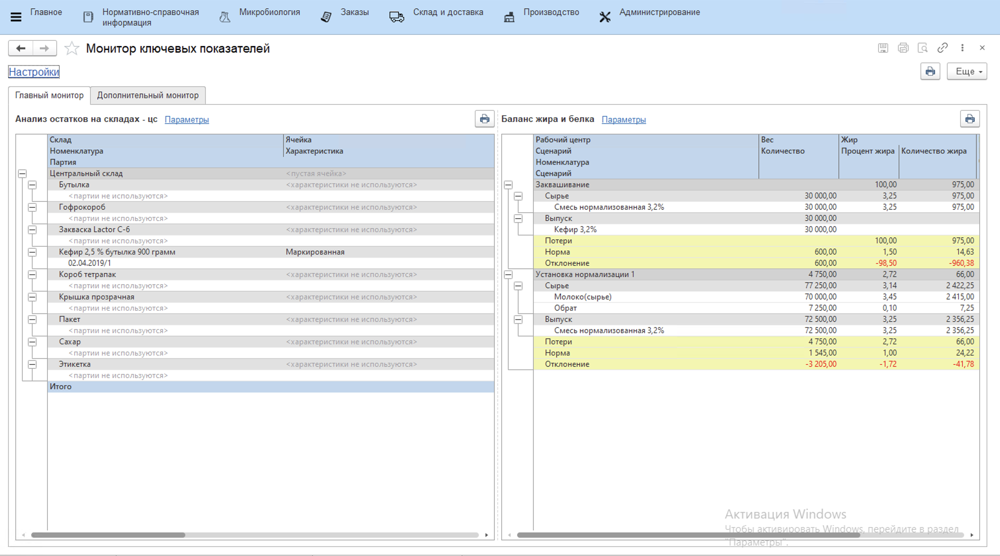

# Описание работы с Монитором ключевых показателей

Для работы с Монитором ключевых показателей необходимо перейти в "Монитор ключевых показателей" в подсистеме "Производство" в разделе "Аналитика". В открывшемся окне рабочего места доступны все вкладки дашборда, созданные ранее и соответствующие текущему пользователю. На выбранной вкладке отображены созданные варианты отчета в настройках.

Для указания общих настроек для всех отчетов необходимо открыть всплывающее окно по гиперссылке в левом верхнем углу рабочего места. Здесь есть возможность указать период, дату смены, формат смены, если включен учет по сменам в параметрах производства, а также масштаб отображения.

Кастомизацию конкретного отчета стоит выполнять после установки общих настроек. Это можно сделать, нажав по гиперссылке "Параметры" над отчетом. В появившемся окне будут доступны все отборы, которые указаны в выбранном варианте отчета.

## Печать отчетности

Вариантов для печати есть несколько: можно распечатать конкретный отчет, либо же распечать комплект всех отчетов, которые отображены на текущей вкладке дашборда. Для этого нужно нажать на иконку "Принтера" сверху над отчетом для первого случая, или нажать на иконку принтера в правом верхнем углу всего дашборда, чтобы распечатать общий комплект. 

