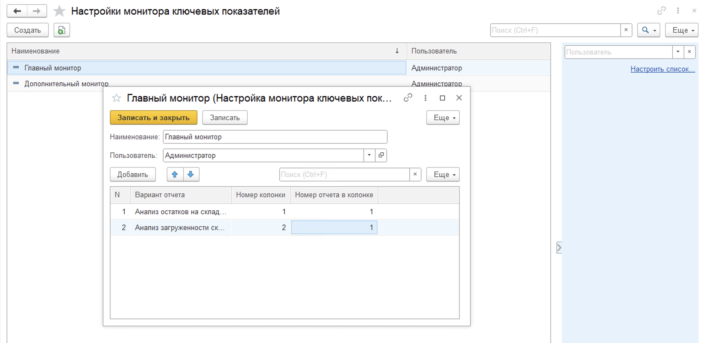
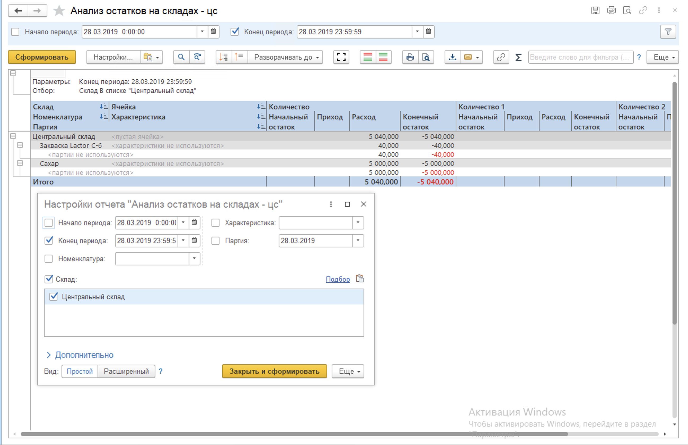

# Настройки монитора ключевых показателей

Для работы с Монитором ключевых показателей необходимо выполнить персональную настройку дашбордов для тех пользователей, кто будет работать с данным рабочим местом. Для этого необходимо перейти в "Настройки монитора ключевых показателей" в подсистеме "Производство" в разделе "Сервис". В открывшемся окне формы списка доступны все созданные настройки с указанием наименования и пользователя, а также доступен отбор по пользователю в правой части. Чтобы завести новую настройку, нужно нажать "Создать" и в открывшемся окне указать:

-   Наименование (Данное поле соответствует названию вкладки на рабочем месте, поэтому рекомендуется указывать соответствующее или информативное наименование);
-   Пользователя;
-   Варианты отчета на дашборде.

Особое внимание стоит уделить настройкам вариантов отчета. Нумерация колонок и отчетов задает расположенние данного отчета на дашборде, она осуществляется слева направо и сверху вниз. 

Сам отчет необходимо настроить отдельно и сохранить как вариант отчета.

Выбранные отборы для указанного варианта отчета будут доступны для редактирования на дашборде Монитора ключевых показателей.