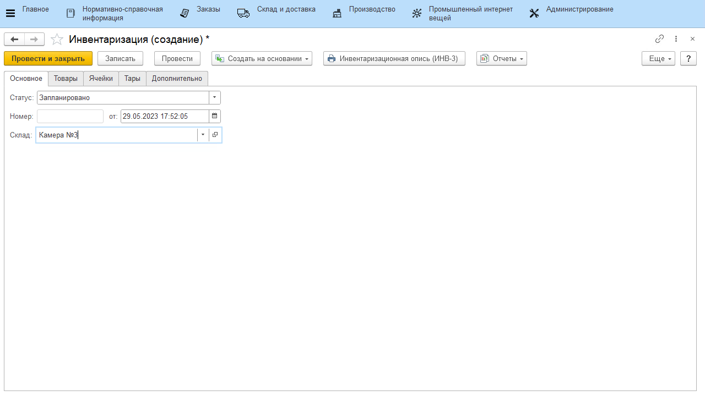
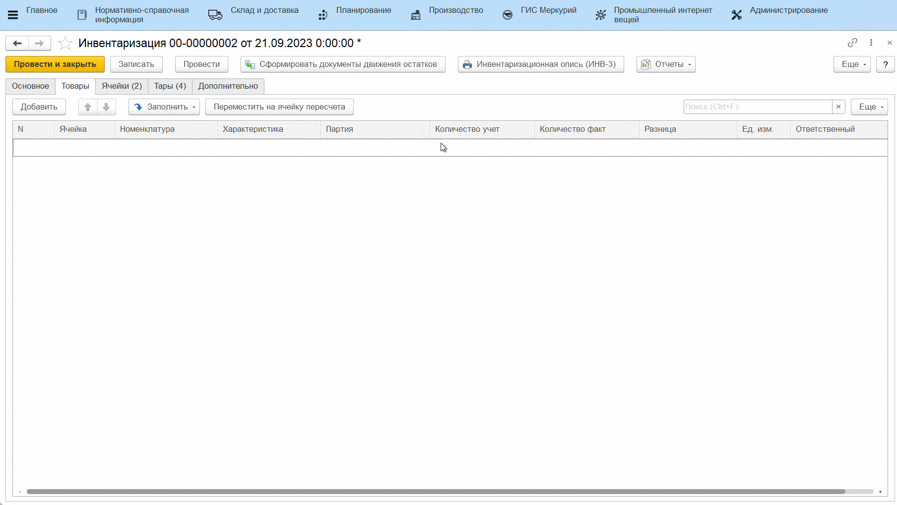
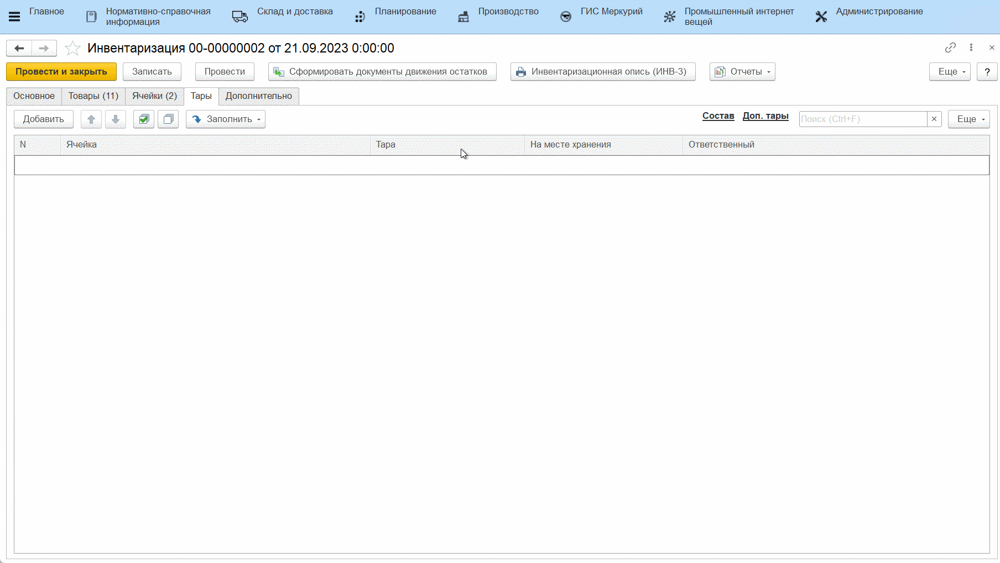

# Пересчет и Инвентаризация продукции с указанием тары

Для оформления инвентаризации и фиксации штрихкодов упаковок для дальнейшего отслеживания, необходимо создать документ **"Пересчет"**.

Документ **"Пересчет"** предназначен для отражения фактического количества товаров на складе. Документ **"Инвентаризация"** предназначен для сравнения количества товаров на складе по учету и количества товаров на складе по факту.

На первом этапе необходимо провести подсчет остатков продукции на складе и занести эти данные в документ **"Пересчет"**, который расположен в разделе **"Склад и доставка"** в подсистеме **"Складская логистика"**.

Документ **"Пересчет"** можно сформировать следующим образом:

- вручную (см. [Простой склад - Инвентаризация](../SimpleWarehouse/Inventar.md));
- с помощью ТСД (см. [Адресный склад - Пересчет на ТСД](../AddressWarehouse/Inventar/PereschetNaTCD.md));
- на киоске;

## Пересчет на киоске

Настройка кнопки учетной точки для проведения инвентаризации:

!!! info ""
    Если выбрана опция **"Создавать пересчет"**, взвешенные на киоске остатки со склада будут записаны в документ **"Пересчет"**. Иначе - сразу в документ **"Инвентаризация"**.

После настройки точки необходимо:

- перейти в меню учетных точек;
- нажать на созданную кнопку;
- заполнить информацию о ячейке, по которой ведется пересчет;
- на вкладке **"Товары"** нужно отсканировать находящиеся на складе остатки и ввести их фактическое количество и вес;
- для составной тары также необходимо указать ее состав с помощью калькулятора тары;
- нажать **"Сохранить"**, информация запишется в документ **"Пересчет"**.

<video source src="../InventoryContainers.assets/1.mp4" width="1024" controls="controls"> </video>

Если на складе обнаружена номенклатура, которая фактически находится на таре, но при сканировании тары эта номенклатура не появляется в таблице (не числится на таре по учету), можно отсканировать этикетку партии, а тару указать вручную, выбрав её в соответствующем поле справа. Тогда номенклатура в документе **"Пересчет"** будет числиться на таре.

## Создание документа "Инвентаризация"

Документ **"Инвентаризация"** расположен в разделе **"Склад и доставка"** в подсистеме **"Складская логистика"**.

При создании документа указываются:

На вкладке **"Основное"**:

- статус;
- номер - заполняется автоматически;
- дата;
- склад.

На вкладке **"Товары"** по кнопке **"Заполнить"** доступны следующие операции:

- *Заполнить по учету* - табличная часть будет заполнена товарами, которые имеются на складе по документации;
- *Заполнить по пересчету* - табличная часть, заполненная по учету, дозаполняется значениями из документа "Пересчета". Если табличная часть не заполнялась по учету, то нажатием этой кнопки заполнится только значениями из документа "Пересчет";
- *Дозаполнить по учету* - табличная часть, заполненная по пересчету, дозаполняется значениями по учету. 

На вкладке **"Товары"** нажатием кнопки **"Заполнить по учету"** табличная часть будет заполнена товарами, которые имеются на складе по документации. Если склад [адресный](../AddressWarehouse/Inventar/PereschetNaTCD.md), для заполнения по учету необходимо выбрать ячейку.

Далее по нажатию на кнопку **"Заполнить по пересчету"**, откроется форма выбора документов **"Пересчет"**, необходимо выбрать на ней нужный документ. В результате в табличной части заполнятся поля **"Количество факт"** и **"Разница"**.

Также нужно заполнить вкладку **"Тары"**. Нажатием кнопки **"Заполнить по учету"** табличная часть будет заполнена тарами, которые имеются на складе по документации. 

- По гиперссылке **"Состав"** можно увидеть учетное и фактическое количество продукции на выбранной таре;
- По гиперссылке **"Доп. тары"** можно увидеть учетное и фактическое количество дополнительной тары, если тара составная. Если дополнительной тары на выбранной таре нет, форма останется пустой.

Далее по нажатию на кнопку **"Заполнить по пересчету"**, откроется форма выбора документов **"Пересчет"**, необходимо выбрать на ней нужный документ. В результате в соответствующих гиперссылках заполнятся **"Количество факт"**, **"Вес факт"** и **"Разница"**.

!!! info "Важно"
    Если на складе ведется учет по таре, и в ходе пересчета была обнаружена тара, которой по учету на складе нет, то после выполнения операции **"Заполнить по пересчету"** необходимо выполнить **"Дозаполнить по учету"**. Таким образом для обнаруженной тары подтянутся значения по учету. 

Для тары, которая по факту находится на складе и была просканирована, автоматически проставляются галочки **"На месте хранения"**.

Для документа **"Инвентаризация"** используется печатная форма: **"Инвентаризационная опись (ИНВ-3)"**

На основании проведенной **Инвентаризация** по кнопке **"Сформировать документы движения остатков"** создаются документы:

- **"Оприходование товаров"** - в случае, когда разница между учетным и фактическим количеством товаров со знаком плюс (т.е. товар на складе имеется, а в документах это не отражено).

- **"Списание товаров"** - в случае, когда разница между учетным и фактическим количеством товаров имеет знак минус (т.е. на складе нет данного товара, а по документам он имеется).

- **"Комплектация тары"** - в случае, когда изменился состав тары (по товарам и/или по составу дополнительной тары). Формируются документы по всему перечню тары на вкладке **"Тары"**.

- **"Распоряжение на перемещение"** - в случае, когда местонахождение тары по учету и по факту отличается. Тары, для которых не стоит галочка "на месте хранения", отправляются на склад/ячейку пересчета. Тары, которые по учету находятся на другом складе, но по факту были обнаружены и просканированы на складе инвентаризации, также перемещаются этим документом.

