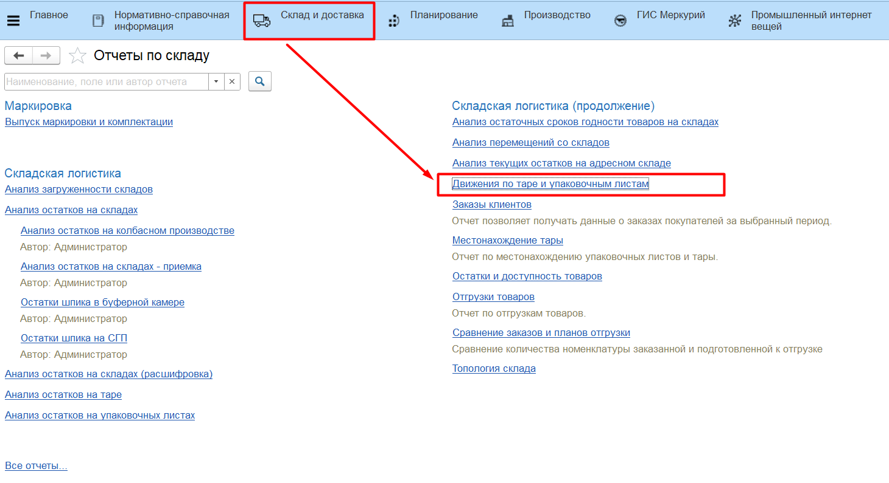

# Детальный учет по упаковочным листам

Детальный учет по упаковочным листам позволяет отслеживать местонахождение паллеты на складе по ее штрихкоду, а также регистрировать изменения в составе паллеты.

## Настройка

Для применения данной функциональной опции в системе необходимо:

1. Включить опцию **"Вести детальный учет по упаковочным листам"** в подсистеме **"Склад и доставка"** в разделе **"Сервис"** - **"Настройки склада и доставки"**. Для перехода на новый вариант учета доступен обработчик обновления;
2. На каждом складе, где важно видеть детальные движения по упаковочным листам, включить опцию **"Вести детальный учет упаковочных листов"**.

## Создаваемые документы

После включения детального учета по упаковочным листам, в системе становятся доступны документы **"Комплектация упаковочного листа"**, а также отчеты **"Анализ остатков на упаковочных листах"** и **"Местонахождение упаковочных листов"**.

### Комплектация упаковочного листа

Документ является регистратором движений по регистру накопления **"Товары на упаковочных листах"** и регистру сведений **"Местонахождение тары"**. Остатки на складе документ не двигает.

На вкладке **"Основное"** указывается:

- Тип операции;
- Основание;
- Комплектуемый упаковочный лист;
- Склад комплектации;
- Ячейка, если склад адресный;

На вкладке **"Товары"** указывается:

- номенклатура, характеристика, партия продукции;
- упаковка, количество упаковок, штрихкод упаковки;
- количество в единицах хранения;

- Документ с типом *"Собрать"* делает приход по регистру "Товары на упаковочных листах" и записывает указанные в табличной части товары на упаковочный лист. При этом по регистру "Местонахождения тары" упаковочный лист помещается на указанный склад;
- Документ с типом *"Разобрать"* делает расход по регистру "Товары на упаковочных листах" и списывает указанные в табличной части товары с упаковочного листа;
- Документ с типом *"Пересобрать"* делает приход и расход по регистру "Товары на упаковочных листах" и актуализирует табличную часть на упаковочном листе;

### Отчет "Анализ остатков на упаковочных листах"

Отчет находится в подсистеме **"Склад и доставка"** -> "Отчеты":

Отчет показывает состав паллеты: номенклатуру, характеристику, партию, упаковку, штрихкод упаковки, количество упаковок, количество в единицах хранения.

### Отчет "Местонахождение тары"

Отчет находится в подсистеме **"Склад и доставка"** -> "Отчеты":

Отчет показывает все паллеты, которые находятся на выбранном складе, их номер и состав: номенклатуру, характеристику, партию, количество в единицах хранения.

### Отчет "Движение по таре и упаковочным листам"

Отчет находится в подсистеме **"Склад и доставка"** -> "Отчеты":

Отчет показывает изменения в составе паллеты: начальный остаток на момент движения, приход, расход, конечный остаток.

Расшифровка отчета показывает, какими именно документами было сделано движение состава паллеты:

### Сценарии работы на складе с учетом движений по упаковочным листам:

- [Паллетирование на ТСД](NewPalletMaking.md)
- [Приемка на ТСД](RecievePL/ReceiptTSD.md)
- [Приемка на ПК](RecievePL/ReceiptPC.md)
- [Приемка на киоске (по накладным)](RecievePL/ReceiptDocs.md)
- [Перемещение на ТСД по типу Размещение](MovingPL/MovingPlacement.md)
- [Перемещение на ТСД по типу Перемещение](MovingPL/Moving.md)
- [Перемещение на ТСД по типу Пересчет](MovingPL/MovingRecount.md)
- [Перемещение на ТСД по типу Отбор](MovingPL/MovingSelection.md)
- [Отгрузка на ТСД](ShipmentPL/ShipmentTSD.md)
