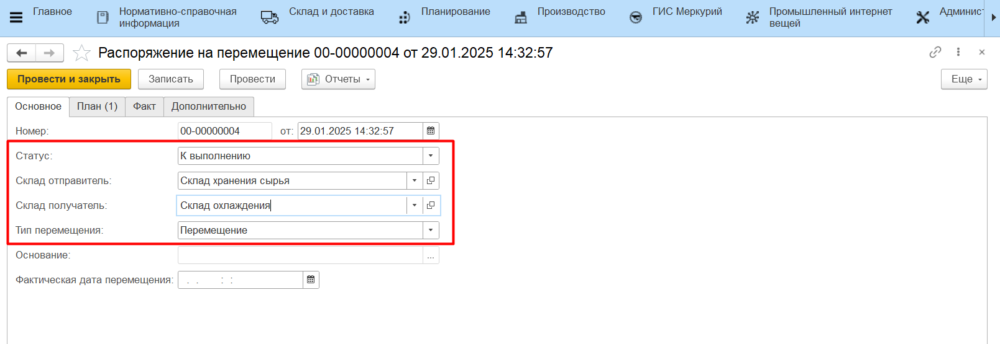
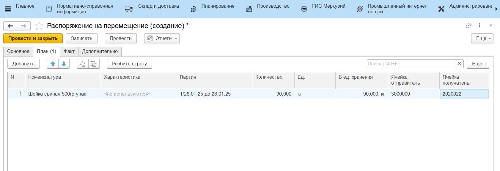
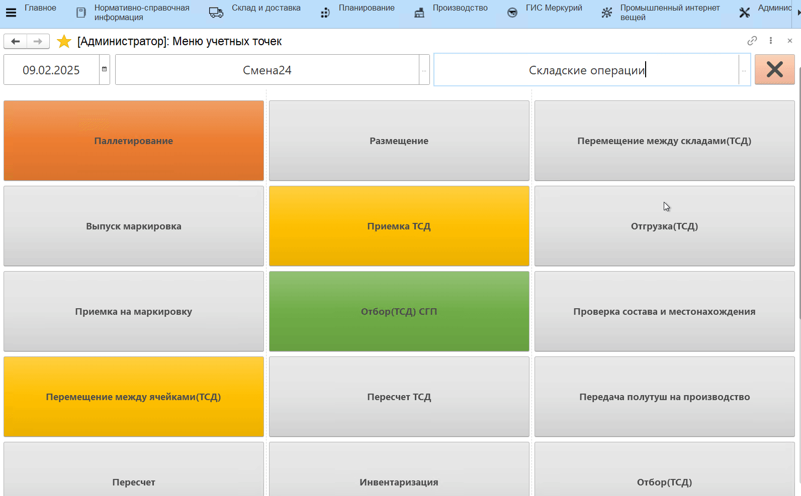
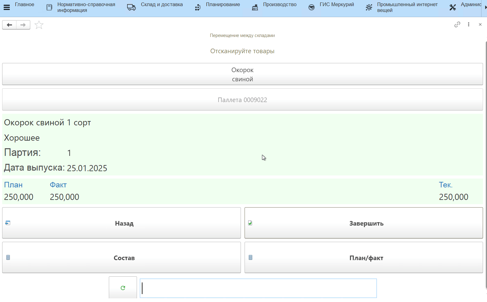
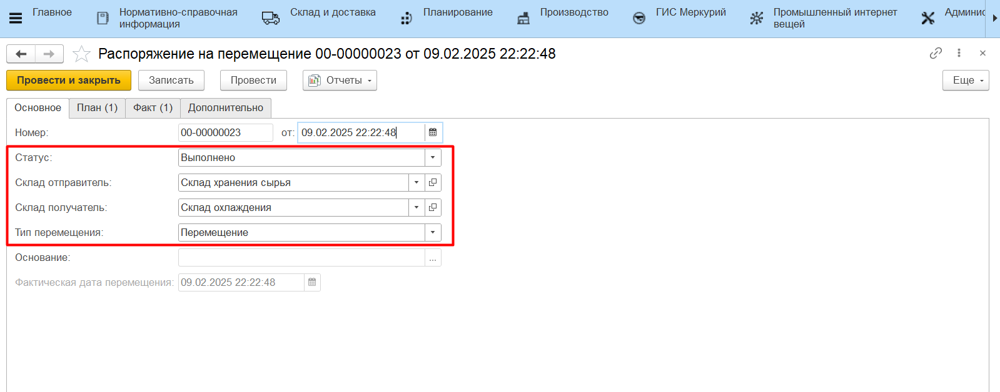
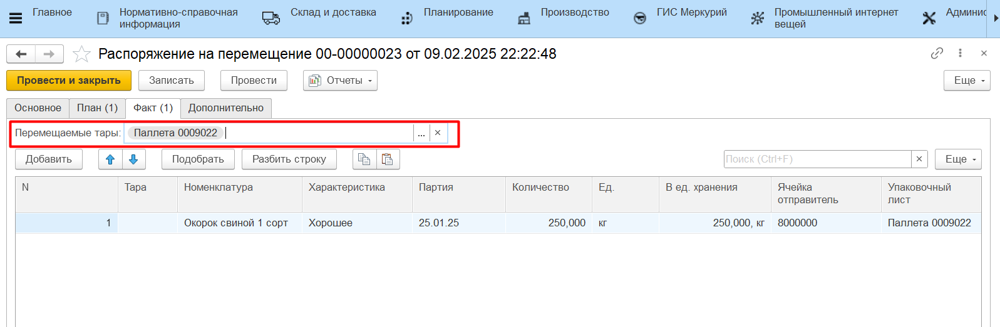
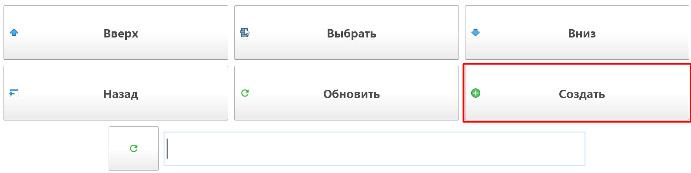

# Перемещение на ТСД по типу Перемещение

Настройка кнопки учетной точки для перемещения на ТСД описана в разделе [Создание и настройка кнопки "Перемещение на ячейку Отгрузки" и "Перемещение м/д складами"](../../AddressWarehouse/Peremeshenie/NastroikaKnopkiPeremeshenie.md).

## Создание документа "Распоряжение на перемещение" с типом "Перемещение"

Документ **"Распоряжение на перемещение"** с типом "Перемещение" с заполненным "Планом" создается вручную. 

При создании указывается:

- Статус. Для того, что бы распоряжение попало в работу, необходимо изменить статус на **"К выполнению"**;
- Склад отправитель;
- Склад получатель;
- Тип перемещения - Перемещение;

На вкладке *"План"* указывается:

- Номенклатура;
- Характеристика;
- Партия;
- Количество;
- Упаковка;
- Ячейка-отправитель, если склад адресный;
- Ячейка-получатель, если склад адресный;

## Перемещение на ТСД "по плану"

Для работы с плановыми "Распоряжениями на перемещение" нужно:

- Зайти в **"Меню учетных точек"**, указать смену и дату смены;
- Зайти в кнопку **"Перемещение между складами"** или **"Перемещение на адресном складе"**;
- В открывшейся форме выбрать документ **"Распоряжение на перемещение"**, с которым будет вестись работа;
- Нажать кнопку **"Выбрать"**, осуществится переход на форму сканирования;
- В открывшейся форме отсканировать штрихкод упаковочного листа, который должен быть перемещен. Номенклатура появится на форме:

Посмотреть состав отсканированной номенклатуры можно по кнопке **"Состав"**. На форме появится список упаковок/единиц номенклатуры, которые по учету лежат на паллете. Если отсканирована неверная паллета, можно удалить строки с помощью кнопки **"Удалить строку"**.

Для завершения перемещения нужно нажать кнопку **"Завершить"**.

В случае, когда в системе ведется детальный учет по упаковочным листам, по итогу перемещения продукции через обработку будет заполнена вкладка "Факт" документа **"Распоряжение на перемещение"** с типом "Перемещение". В данном сценарии состав паллет не меняется, а **"Распоряжение на перемещение"** только актуализирует местонахождение паллеты по регистру **"Местонахождение тары"** и двигает остатки на складах.

## Перемещение на ТСД "по факту"

В системе также предусмотрена возможность перемещения между складами/ячейками и без планового **"Распоряжения на перемещение"**. Для того, чтобы отразить фактическое перемещение нужно на форме выбора документов нажать кнопку **"Создать"**. 

Затем сканируются перемещаемые паллеты. После завершения перемещения, будет создан новый документ **"Распоряжение на перемещение"** с типом "Перемещение" с заполненной вкладкой "Факт". Документ также сделает движение по остаткам на складах и регистру **"Местонахождение тары"**.

Результаты перемещения можно проверить отчетами **"Анализ остатков на упаковочных листах"** и **"Местонахождение упаковочных листов"**.