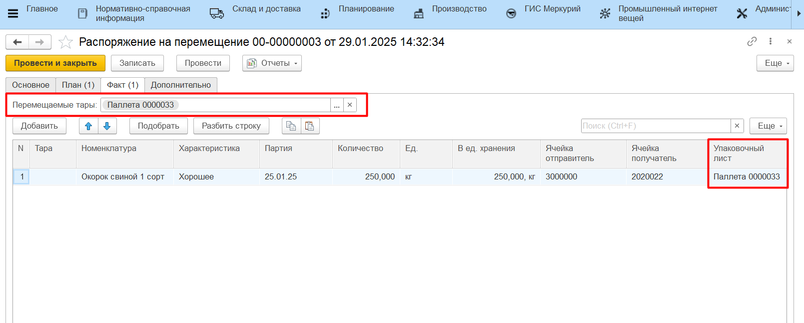

# Перемещение на ТСД по типу Размещение

Настройка кнопки учетной точки для размещения на ТСД описана в разделе [Создание и настройка кнопок "Приемка" и "Размещение"](../../AddressWarehouse/Priemka/NastroikaKnopkiPriemka.md).

Подробнее сценарий размещения рассмотрен в разделе [Приемка готовой продукции на ТСД](../../AddressWarehouse/Priemka/PriemkaNaTCD.md).

В случае, когда в системе ведется детальный учет по упаковочным листам, по итогу размещения продукции через обработку будет заполнена вкладка "Факт" документа **"Распоряжение на перемещение"** с типом "Размещение". В данном сценарии состав паллет не меняется, а **"Распоряжение на перемещение"** только актуализирует местонахождение паллеты по регистру **"Местонахождение тары"** и двигает остатки на складах.

Результат размещения также можно проверить отчетами **"Анализ остатков на упаковочных листах"** и **"Местонахождение упаковочных листов"**.