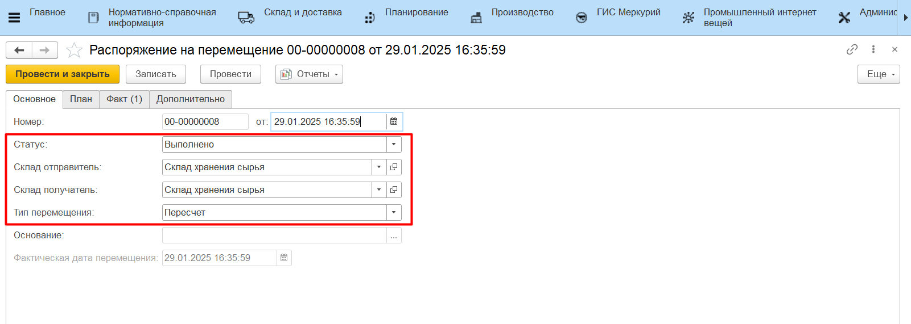
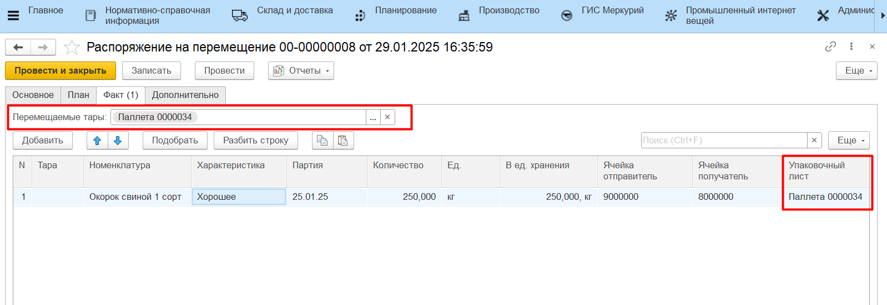

# Перемещение на ТСД по типу Пересчет

Настройка кнопки учетной точки для перемещения по типу "Пересчет" на ТСД описана в разделе [Настройка кнопки учетной точки "Пересчет"](../../AddressWarehouse/VnutriskladskieOper/PereschetNaYacheike/NastroykaKnopkiPereschet.md).

Подробнее сценарий перемещения рассмотрен в разделе [Перемещение на адресном складе по типу Пересчет](../../AddressWarehouse/VnutriskladskieOper/PereschetNaYacheike/PeremesheniePoTipuPereschet.md).

В случае, когда в системе ведется детальный учет по упаковочным листам, по итогу перемещения продукции через обработку будет заполнена вкладка "Факт" документа **"Распоряжение на перемещение"** с типом "Пересчет". В данном сценарии состав паллет не меняется, а **"Распоряжение на перемещение"** только актуализирует местонахождение паллеты по регистру **"Местонахождение тары"** и двигает остатки на складах.

Результат размещения также можно проверить отчетами **"Анализ остатков на упаковочных листах"** и **"Местонахождение упаковочных листов"**.