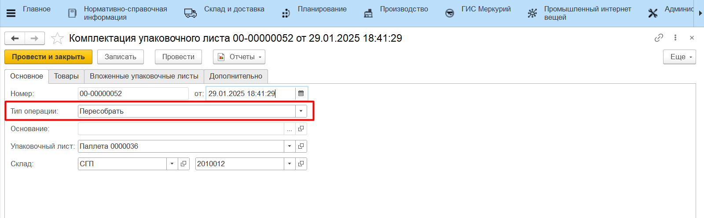
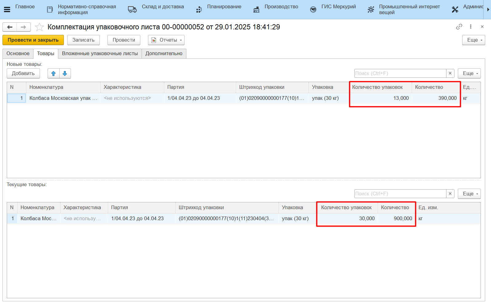
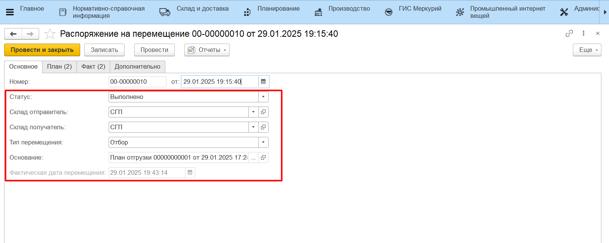
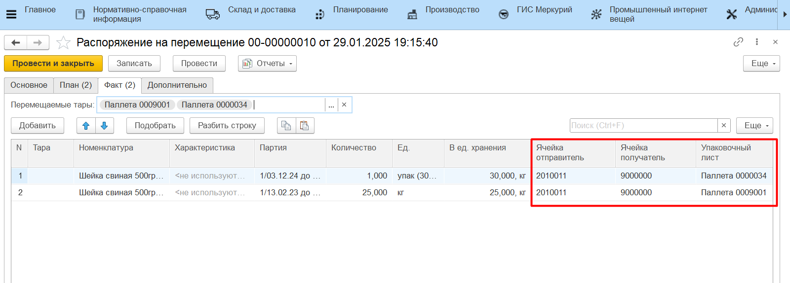

# Перемещение на ТСД по типу Отбор

Настройка кнопки учетной точки для отбора на ТСД описана в разделе [Создание и настройка кнопок "Отбор под отгрузку" и "Отгрузка"](../../AddressWarehouse/Otgruzka/NastroikaKnopkiOtgruzka.md).

Подробнее про сценарий отбора под отгрузку и формирование документа **"Распоряжение на перемещени"** с типом "Отбор" описано в разделе [Отгрузка готовой продукции](../../AddressWarehouse/Otgruzka/OtgruzkaNaTCD.md).

В случае, когда в системе ведется детальный учет по упаковочным листам, по итогу отбора продукции через обработку будет заполнена вкладка "Факт" документа **"Распоряжение на перемещение"** с типом "Отбор". 

Если проводился активный отбор (отбор с составлением новых паллетных листов), то дополнительно будут сформированы документы:

- **"Упаковочный лист"** для каждой новой паллеты;
- **"Комплектация упаковочного листа"** с типом "Собрать" для каждой новой паллеты;
- **"Комплектация упаковочного листа"** с типом "Пересобрать" для паллет, с которых сняли короба (не полностью).
- **"Комплектация упаковочного листа"** с типом "Разобрать" для паллет, с которых сняли все короба (полностью).

Если проводился паллетный отбор (отбор целиком по паллетам), то никаких документов, кроме **"Распоряжение на перемещение"**, сформировано не будет. В данном сценарии состав паллет не меняется, а **"Распоряжение на перемещение"** только актуализирует местонахождение паллеты по регистру **"Местонахождение тары"** и двигает остатки на складах.

Результат отбора также можно проверить отчетами **"Анализ остатков на упаковочных листах"** и **"Местонахождение упаковочных листов"**.