# Паллетирование на ТСД

## Настройка кнопки учетной точки для приемки на ТСД

Для группировки номенклатуры в паллетные листы на складе используется терминал сбора данных и обработка **"Паллетирование"**.

При создании кнопки учетной точки **"Паллетирование"** указываются:

- Наименование;
- Учетная точка;
- Обработка - Терминал сбора данных.

На вкладке **"Настройки"** заполняются:

- Операция - "Паллетирование";
- Рабочий центр;
- Склад комплектации;
- Возможность создания упаковочного листа;
- Контроль уникальности коробов - дополнительная проверка на отсутствие или наличие идентификатора уникальности короба (21) для штрихкодов типа GS1-128;
- Организация и макет для печати.

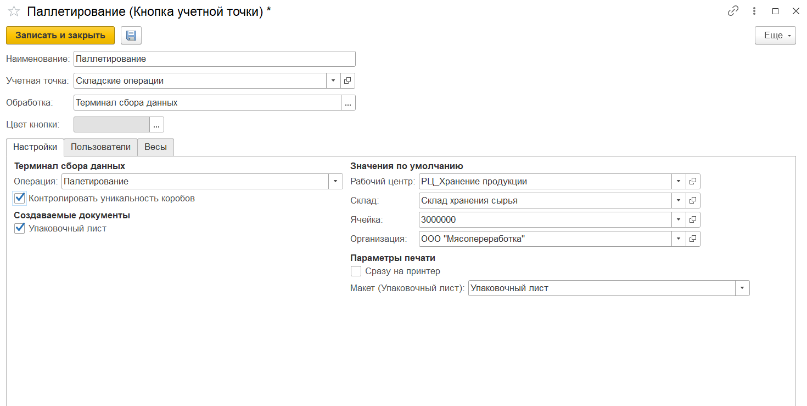

На вкладке **"Пользователи"** можно настроить индивидуальные права доступа на данную команду.

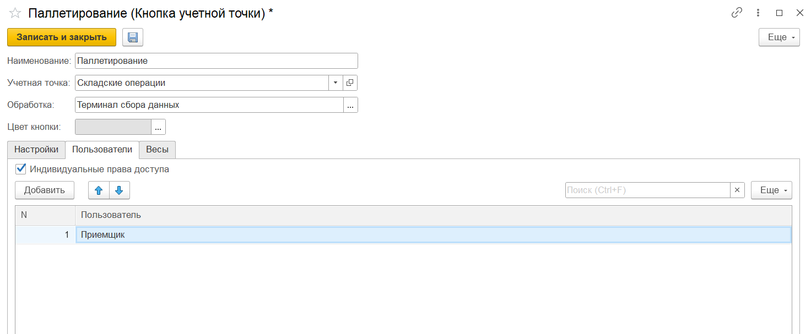

## Паллетирование с созданием нового упаковочного листа

Этот сценарий подойдет для помещения коробов, которые еще не числятся в системе, на новую паллету. Например, паллеты от поставщика сначала расспаллечивают в отдельной зоне и создают для них новые упаковочные листы уже в МЕС-системе.

Для этого нужно:

- Зайти в **"Меню учетных точек"**, указать смену и дату смены;
- Зайти в кнопку **"Паллетирование"**;
- В открывшейся форме отсканировать штрихкоды коробов (GS1-128). Номенклатура появится на форме:

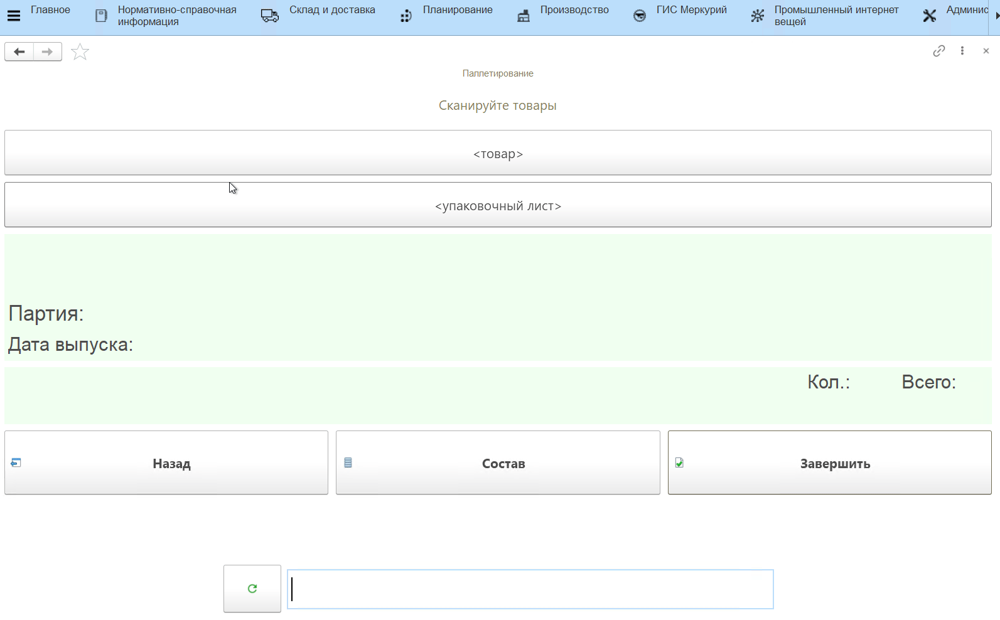

Посмотреть состав отсканированной номенклатуры можно по кнопке **"Состав"**. На форме появится список отсканированных упаковок. Если отсканированs неверные короба, можно удалить строки с помощью кнопки **"Удалить строку"**.

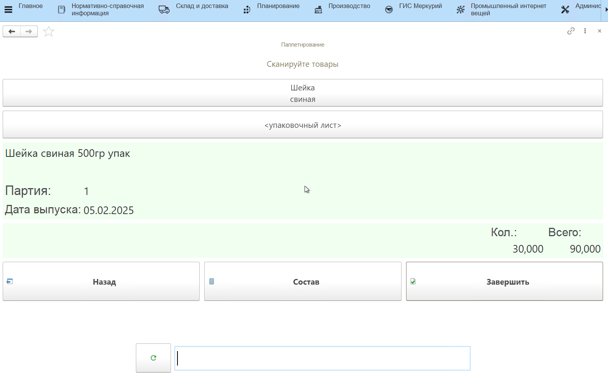

Для завершения работы по приемке нужно нажать кнопку **"Завершить"**.

В результате будет создан документ **"Упаковочный лист"** и документ **"Комплектация упаковочного листа"** с типом "Собрать", который запишет отсканированные при приёмке короба на созданный упаковочный лист. **Одна операция паллетирования создает одну паллету!**

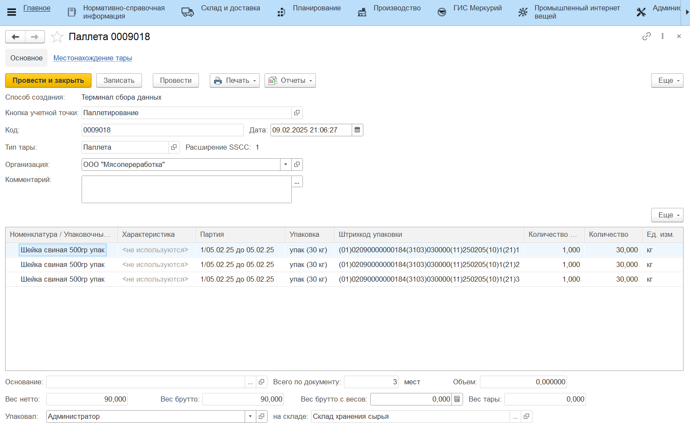
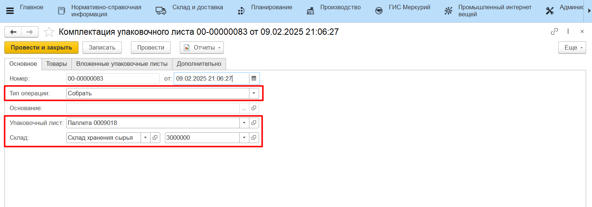
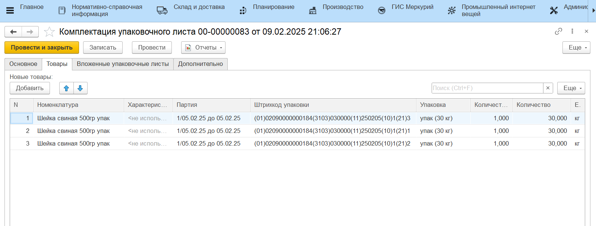

## Перепаллетирование

В случае, если нужно актуализировать состав готовой паллеты, например, добавить несколько коробов, можно пройти по сценарию выше и пересчитать все короба на паллете сканированием, сформировав новый упаковочный лист, либо воспользоваться сканированием паллеты. Для этого:

- В открывшейся форме отсканировать штрихкод упаковочного листа;
- Отсканировать штрихкоды коробов (GS1-128), которые нужно добавить на паллету. Номенклатура появится на форме;
- При необходимости на вкладке **"Состав"** удалить короба, которых недостает на паллете;
- Завершить приемку по кнопке **"Завершить"**.

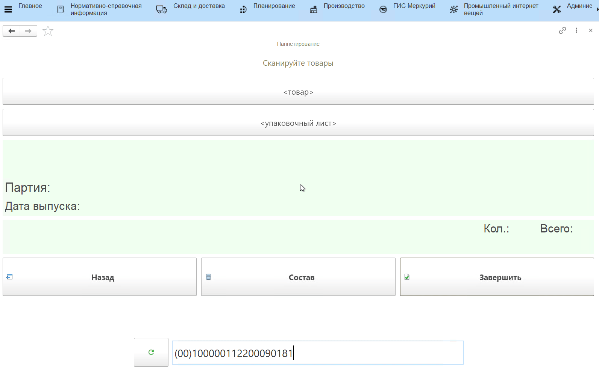

В результате будет создан документ **"Упаковочный лист"**, документ **"Комплектация упаковочного листа"** с типом "Собрать", который запишет отсканированные при приёмке короба на созданный упаковочный лист, и документ **"Комплектация упаковочного листа"** с типом "Разобрать" для отсканированной ранее паллеты.

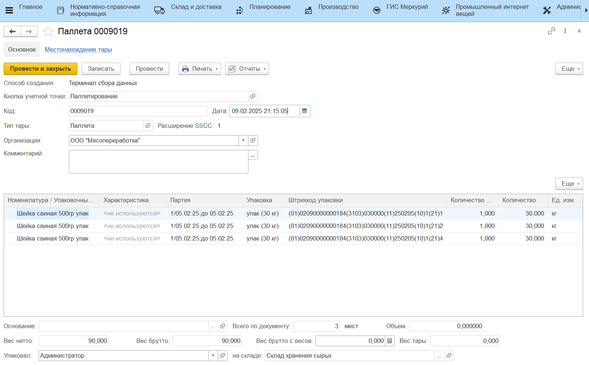
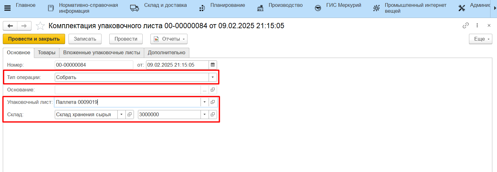
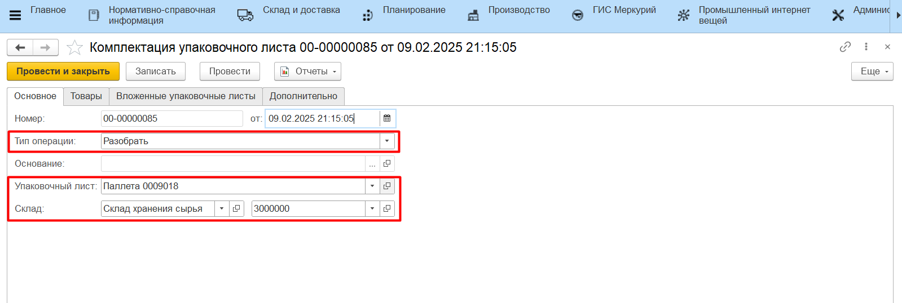

!!! info "Важно"

    Операция паллетирования или перепаллетирования не двигает остатки на складе, только остатки на упаковочных листах.