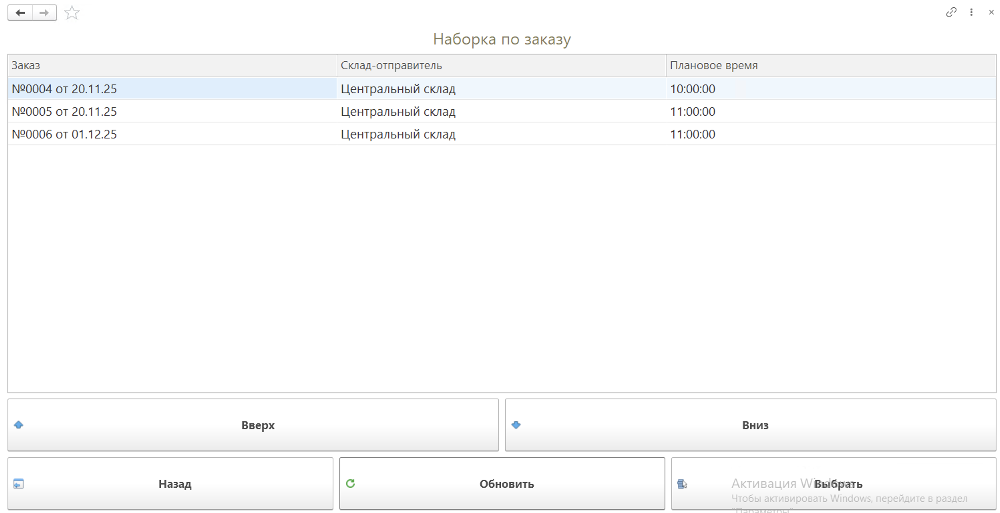
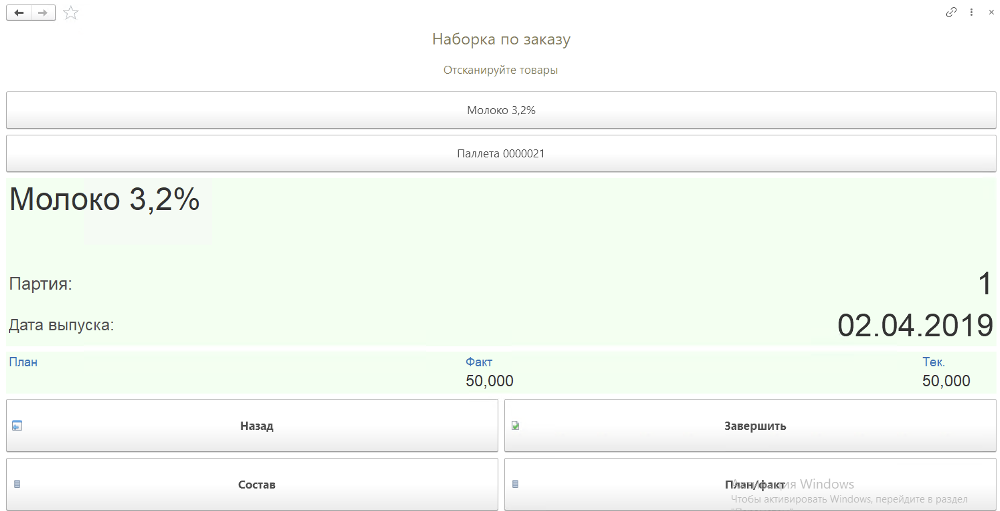
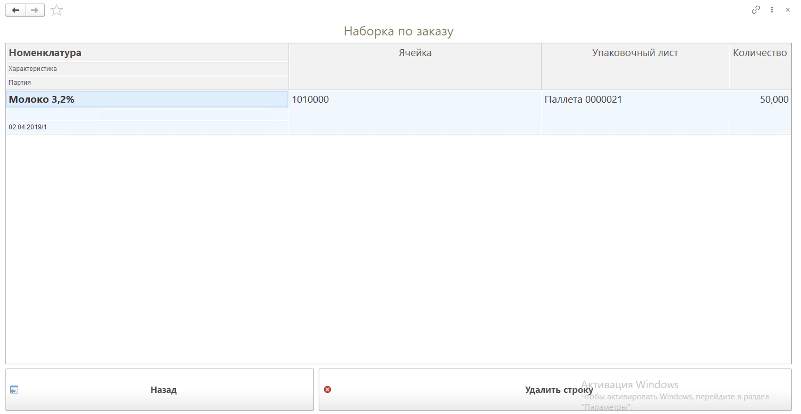
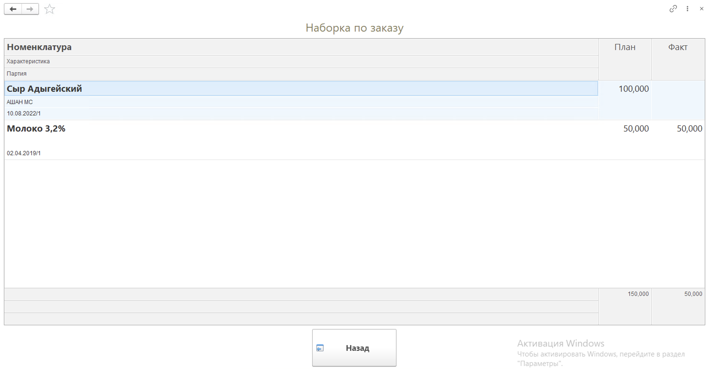
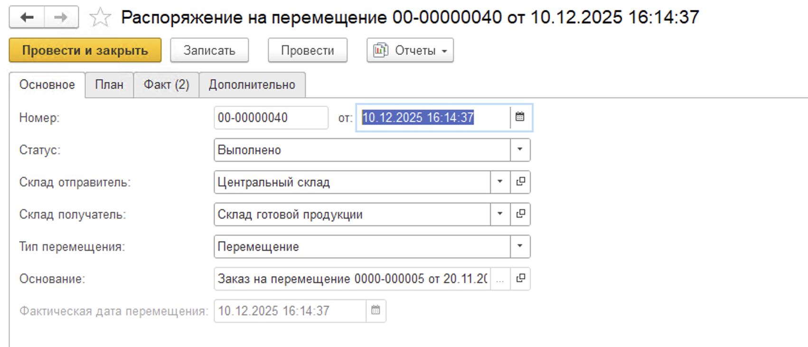
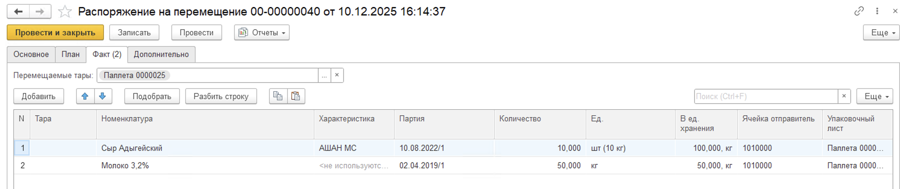

# Приемка сырья по заказу (ТСД)

Отобранную ранее продукцию необходимо принять на складе-получателе. Для этого необходимо:

- Открыть **"Меню учетных точек"**, выбрать дату смены, смену и рабочий центр;
- Нажать кнопку **"Приемка сырья по заказу"**.

В открывшейся форме будут доступны документы Заказ на перемещение к выбору для работы. Отбор осуществляется на основании склада-получателя, указанного в настройках кнопки учетной точки, а также статуса Заказа на перемещение "Собрано".

В табличной части указаны номера и даты документов, склады-отправители и наименьшее плановое время отгрузки из документа Заказ на перемещение. Для дальнейшей работы необходимо выбрать документ с помощью кнопок "Вверх", "Вниз" и "Выбрать".

На странице работы с заказом необходимо будет отсканировать упаковочный лист. В данном АРМе к приемке положен полный состав упаковочного листа, поэтому возможности отобрать часть продукции - нет. Кроме того при сканировании Упаковочного листа производится проверка, есть ли он в плане приемки по текущему Заказу на перемещение.

На форме сканирования отображается план-факт по выбранной номенклатуре, а также вес текущего сканирования. 

По кнопке **"Состав"** можно посмотреть информацию о текущем сканировании и при ошибочном сканировании удалить строку:

Посмотреть план-факт по выбранной строке заказа можно по кнопке **"План/факт"**:

Когда все паллеты просканированы, необходимо нажать кнопку **"Завершить"**. Будет сформирован документ **"Распоряжение на перемещение"** с типом "Перемещение" и в статусе "Выполнено", а документ **"Заказ на перемещение"** переведен в статус "Принято". 

Если была включена функциональная опция "Создание плановых РнП" в настройках Кнопки учетной точки "Передача сырья по заказу" и было сформировано Плановое Распоряжение на перемещение, тогда по завершении Приемки сырья по заказу данный документ будет заполнен фактической информацией по приемке.

