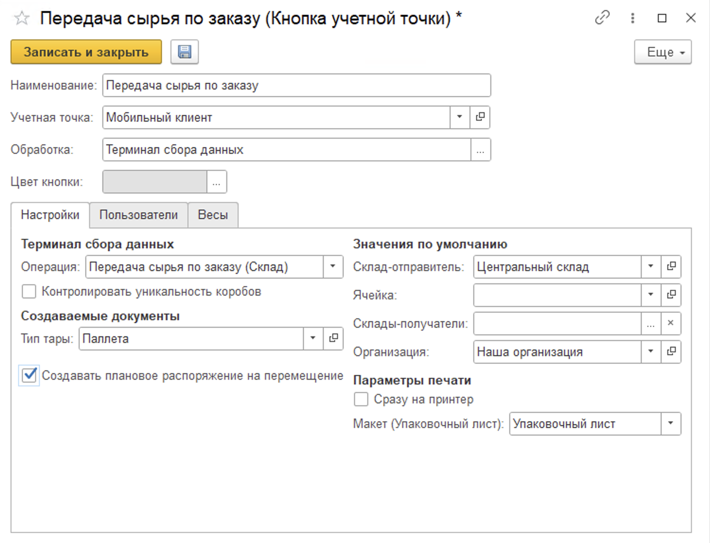
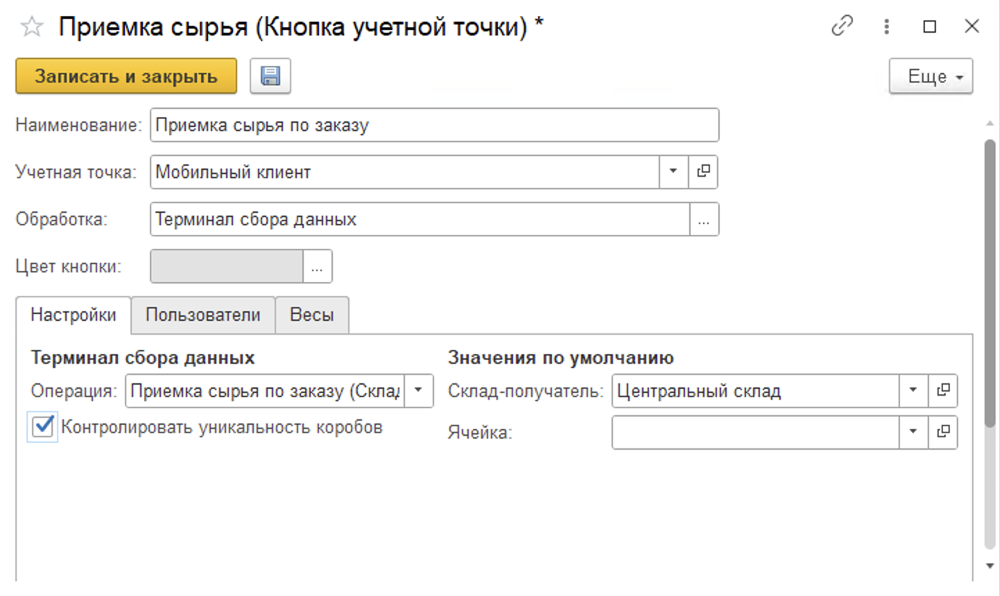

# Настройка кнопок учетной точки для передачи и приемки сырья по заказам на ТСД

## Передача сырья по заказу

Для передачи продукции по документам Заказ на перемещение используется терминал сбора данных и обработка **"Передача сырья по заказу"**.

При создании кнопки учетной точки **"Передача сырья по заказу"** указываются:

- Наименование;
- Учетная точка;
- Обработка - Терминал сбора данных;
- Цвет кнопки в МУТ.

На вкладке **"Настройки"** заполняются:

- Операция - Передача сырья по заказу (Склад);
- Склад-отправитель;
- Ячейка-отправитель, если склад адресный (если не заполнена, потребуется сканирование в начале работы);
- Склады-получатели (необходимы для отборов по Заказам на перемещение);
- Возможность создания упаковочного листа - если включена, по итогу перемещения будут создаваться новые упаковочные листы;
- Организация и макет для печати.

А также функциональные опции:

- Контроль уникальности коробов - дополнительная проверка на отсутствие или наличие идентификатора уникальности короба (21) для штрихкодов типа GS1-128;
- Создание плановых РнП - создание дополнительного документа

На вкладке **"Пользователи"** можно настроить индивидуальные права доступа на данную команду.

## Приемка сырья по заказу

Для приемки продукции по документам Заказ на перемещение используется терминал сбора данных и обработка **"Приемка сырья по заказу"**.

При создании кнопки учетной точки **"Приемка сырья по заказу"** указываются:

- Наименование;
- Учетная точка;
- Обработка - Терминал сбора данных;
- Цвет кнопки в МУТ.

На вкладке **"Настройки"** заполняются:

- Операция - Приемка сырья по заказу (Склад);
- Склад-получатель;
- Ячейка-получатель, если склад адресный.

А также функциональная опция:

- Контроль уникальности коробов - дополнительная проверка на отсутствие или наличие идентификатора уникальности короба (21) для штрихкодов типа GS1-128.

На вкладке **"Пользователи"** можно настроить индивидуальные права доступа на данную команду.