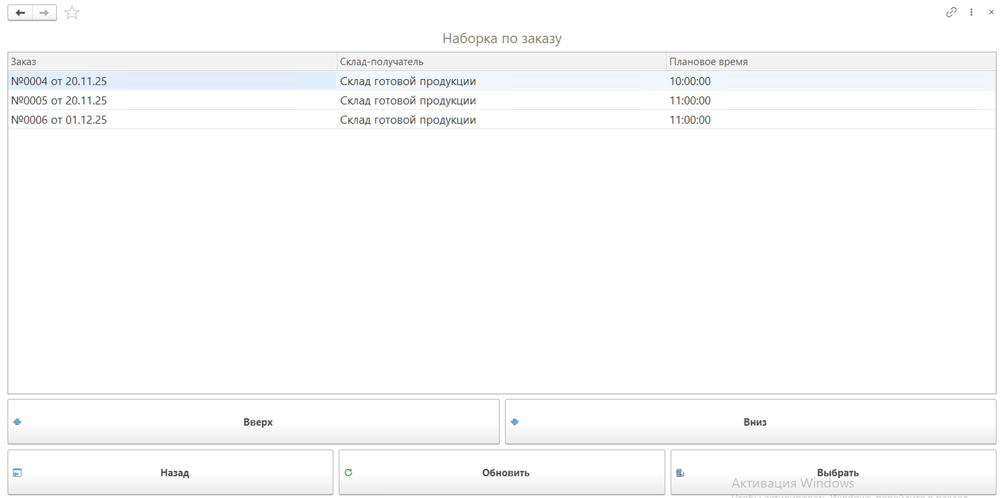
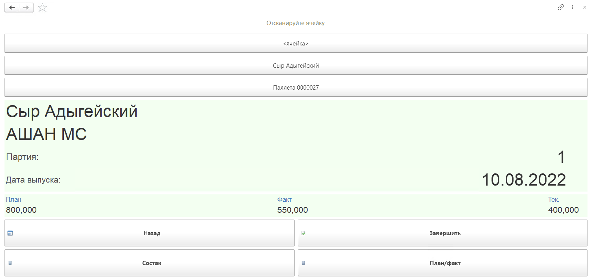
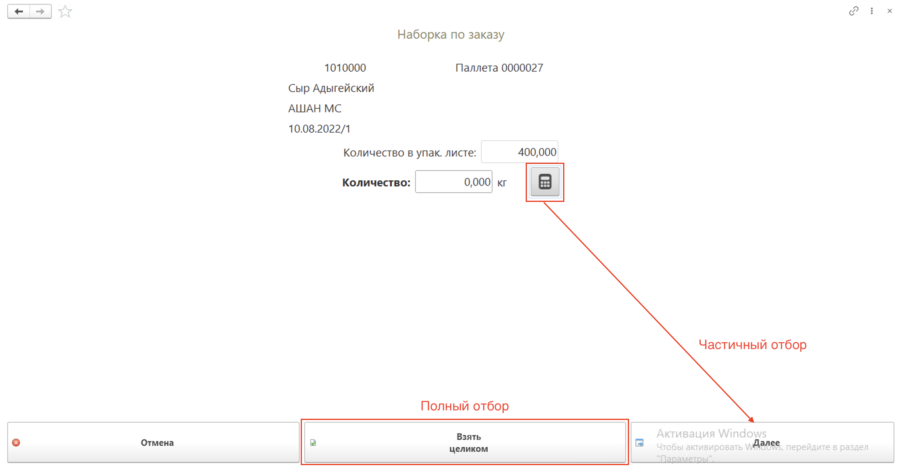
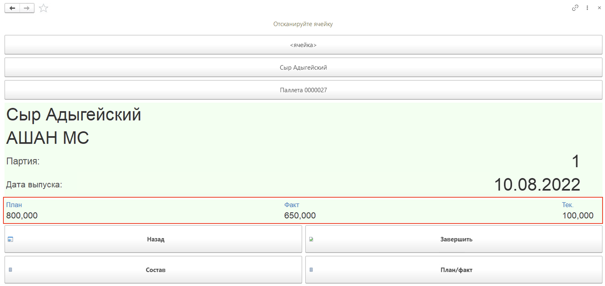
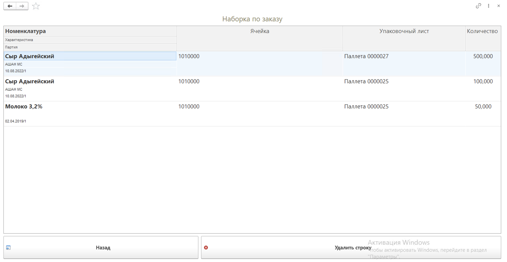
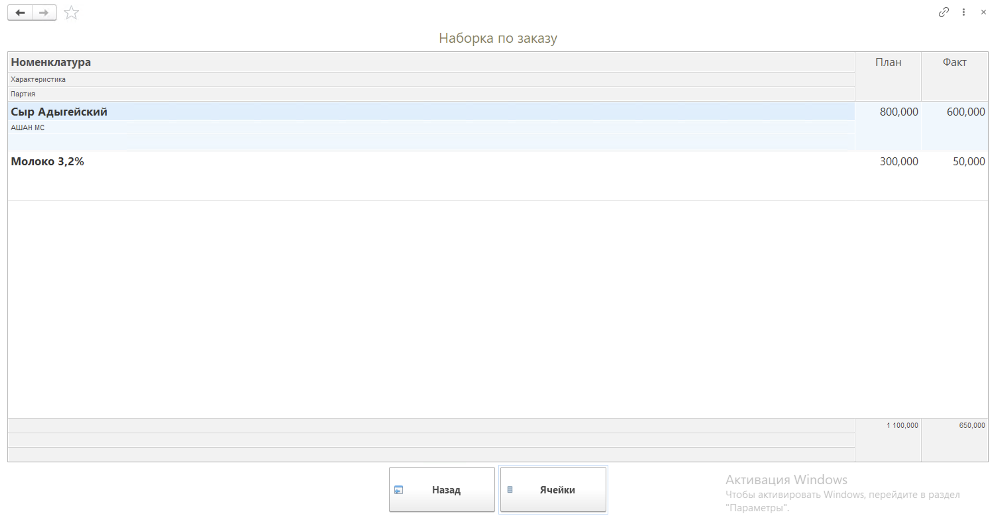
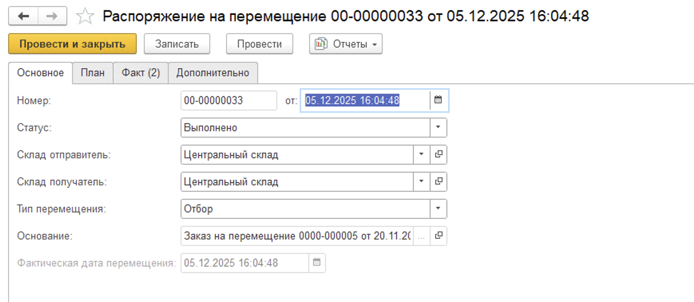
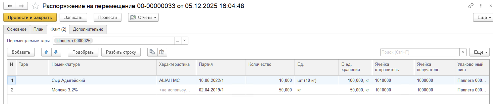
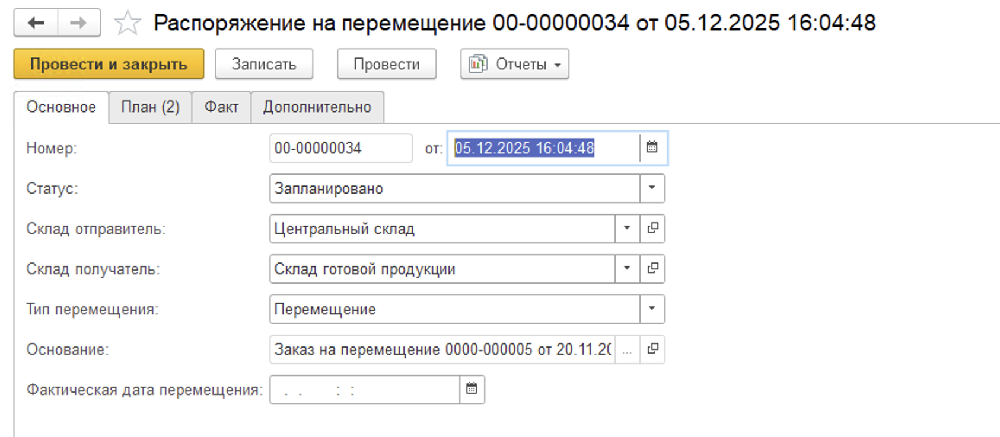
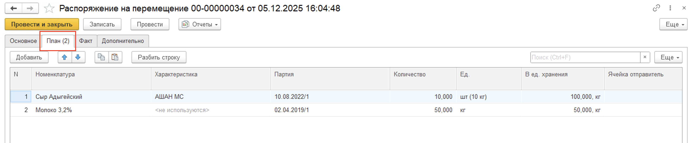

# Передача сырья по заказу (ТСД)

Для отражения передачи со склада сырья на склад производства необходимо:

- Открыть **"Меню учетных точек"**, выбрать дату смены, смену и рабочий центр;
- Нажать кнопку **"Передача сырья по заказу"**.

В открывшейся форме будут доступны документы Заказ на перемещение к выбору для работы. Отбор осуществляется на основании склада-отправителя, складов-получателей, указанных в настройках кнопки учетной точки, а также статуса Заказа на перемещение "В наборку".

В табличной части указаны номера и даты документов, склады-получатели и наименьшее плановое время отгрузки из документа Заказ на перемещение. Для дальнейшей работы необходимо выбрать документ с помощью кнопок "Вверх", "Вниз" и "Выбрать".

На открывшейся странице сканирования необходимо указать ячейку склада-отправителя, если она не выбрана в настройках кнопки учетной точки. Для активной опции "Вести детальный учет упаковочных листов" появляется возможность сканирования Упаковочного листа с автоматическим определением его местоположения в ячейке на складе при выполнении операции Отбора под отгрузку. В данном случае можно пропустить сканирование ячейки хранения и сразу отсканировать упаковочный лист, тогда ячейка автоматически заполнится в документе.

После сканирования упаковочного листа откроется страница, содержащая информацию о паллете, с возможностью выбора количества. Необходимо указать частичный отбор продукции с помощью калькулятора или выбрать полное количество к перемещению с помощью кнопки "Взять целиком".

На форме сканирования отображается план-факт по выбранной номенклатуре, а также вес текущего сканирования. 

По кнопке **"Состав"** можно посмотреть информацию о текущем сканировании и при ошибочном сканировании удалить строку:

Посмотреть план-факт по выбранной строке заказа можно по кнопке **"План/факт"**:

На данной странице можно выбрать номенклатуру по плану из списка и по кнопке "Ячейки" посмотреть в какой ячейке лежат остатки текущей номенклатуры на данном складе-отправителе.

Когда все паллеты просканированы, необходимо нажать кнопку **"Завершить"**. Будет сформирован документ **"Распоряжение на перемещение"** с типом "Отбор" и в статусе "Выполнено", а документ **"Заказ на перемещение"** переведен в статус "Собрано". Кроме того будет изменен документ **"Упаковочный лист"** для старой паллеты, создан документ **"Упаковочный лист"** для новой паллеты, документ **"Комплектация упаковочного листа"** с типом "Собрать", который запишет отобранную продукцию на созданный упаковочный лист, и документ **"Комплектация упаковочного листа"** с типом "Разобрать" для отсканированной ранее паллеты. Если паллета была отобрана полностью, то новый упаковочный лист не будет создан.

Если была включена функциональная опция "Создание плановых РнП" в настройках Кнопки учетной точки, тогда по завершении будет создан еще один документ "Распоряжение на перемещение" с типом "Перемещение" в статусе "Запланировано". Склад-получатель будет выбран из Заказа на перемещение, табличная часть "План" соответствовать отобранной продукции:

Данной операцией можно воспользоваться без активной функциональной опции "Вести детальный учет упаковочных листов". В этом случае по результатам работы в АРМе будут созданы только новые упаковочные листы для старой и новой паллеты, а документы Комплектация тар не будут.

