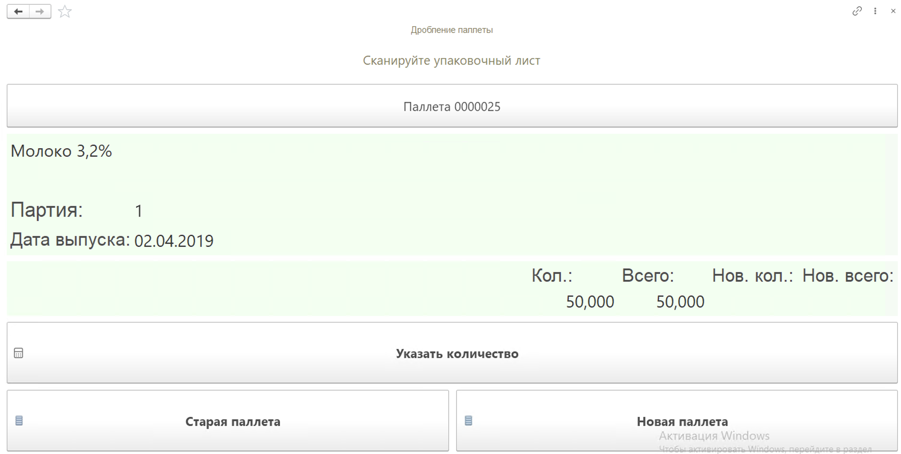
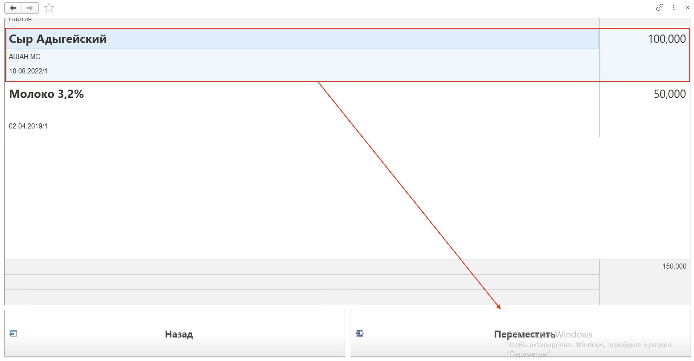
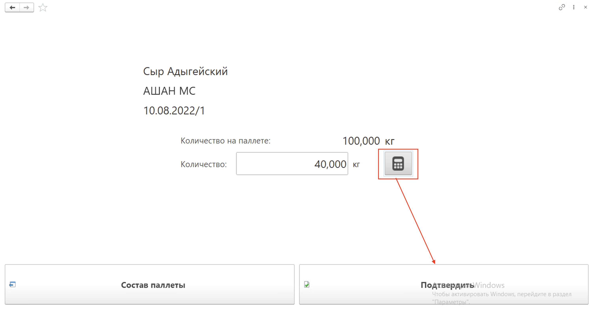
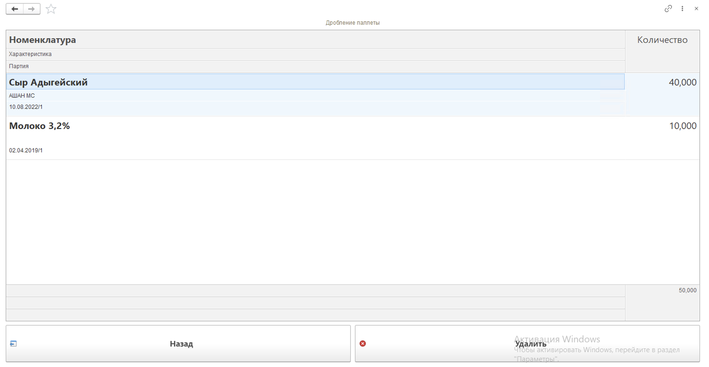
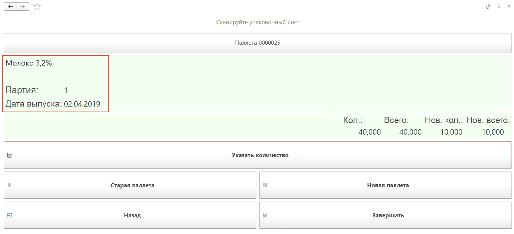

# Дробление паллеты

В случае, если нужно разбить состав существующей паллеты, при этом получить новую паллету с частью продукции старой паллеты, необходимо воспользоваться операцией **"Дробление паллеты"**. Для этого:

- Зайти в **"Меню учетных точек"**, указать смену и дату смены;
- Зайти в кнопку **"Дробление паллеты"**;
- В открывшейся форме отсканировать штрихкод упаковочного листа к дроблению;

- Дробление осуществляется путем переноса продукции на новую паллету. Для этого необходимо выбрать номенклатуру на странице "Старая паллета", далее указать количество к переносу;

- На странице "Новая паллета" можно посмотреть состав отобранной продукции к переносу, а также удалить ненужные строчки;

- На главной странице можно осуществить еще один отвес номенклатуры без необходимости повторного выбора через список. Для этого нужно нажать на кнопку "Указать количество";

- В конце операции нажать кнопку "Завершить".

В результате будет изменен документ **"Упаковочный лист"** для старой паллеты, создан документ **"Упаковочный лист"** для новой паллеты, документ **"Комплектация упаковочного листа"** с типом "Собрать", который запишет отобранную продукцию на созданный упаковочный лист, и документ **"Комплектация упаковочного листа"** с типом "Разобрать" для отсканированной ранее паллеты.

Данной операцией можно воспользоваться без активной функциональной опции "Вести детальный учет упаковочных листов". В этом случае по результатам работы в АРМе будут созданы только новые упаковочные листы для старой и новой паллеты, а документы Комплектация тар не будут.

!!! info "Важно"

    Операция "Дробление паллеты" не двигает остатки на складе, только остатки на упаковочных листах.