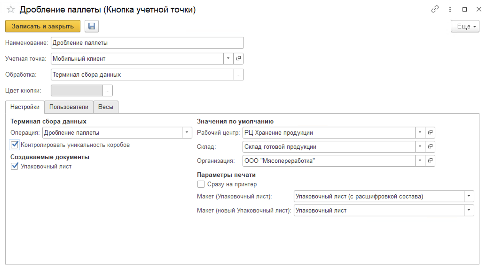

# Создание и настройка кнопки "Дробление паллеты"

Кнопка **"Дробление паллеты"** используется для разбиения существующей паллеты на две новых.

При создании кнопки учетной точки **"Дробление паллеты"** указываются:

- Наименование;
- Учетная точка;
- Обработка -Терминал сбора данных;
- Цвет кнопки в МУТ.

На вкладке **"Настройки"** заполняются:

- Операция - Дробление паллеты;
- Рабочий центр;
- Склад;
- Возможность создания упаковочного листа, в случае создания заполняются поля организация и макет для печати
- Контроль уникальности коробов - дополнительная проверка на отсутствие или наличие идентификатора уникальности короба (21) для штрихкодов типа GS1-128;
  
