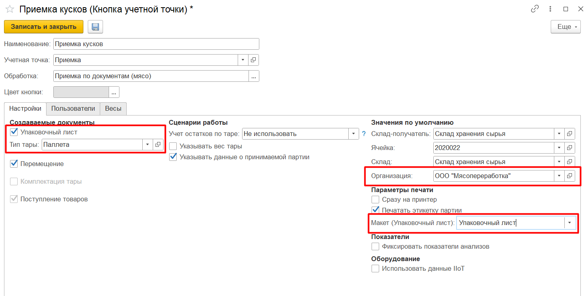
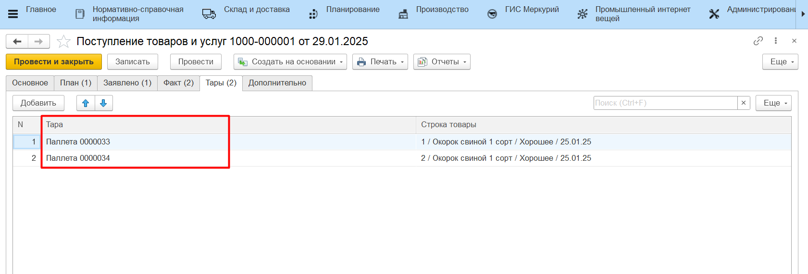
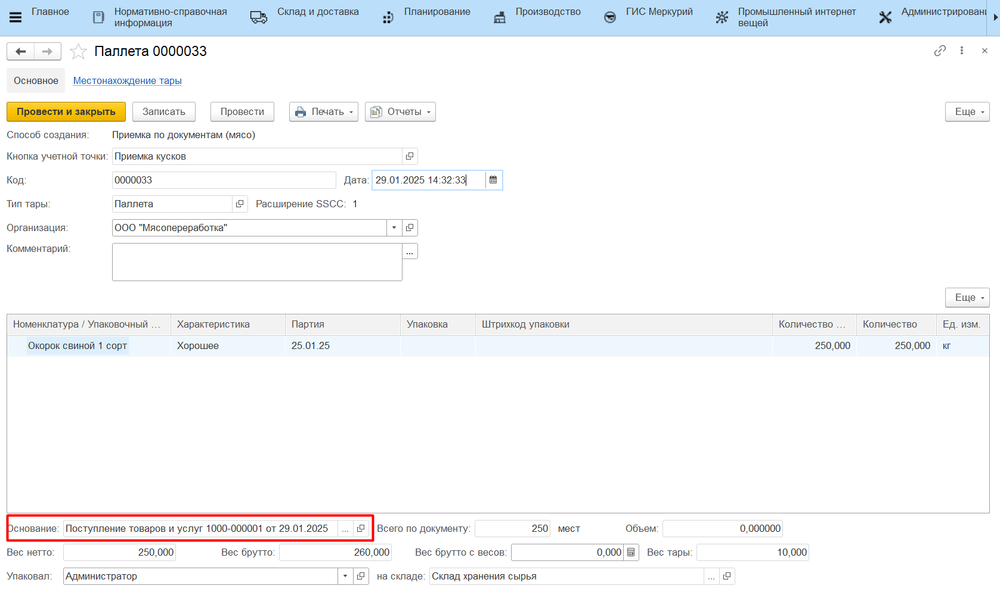
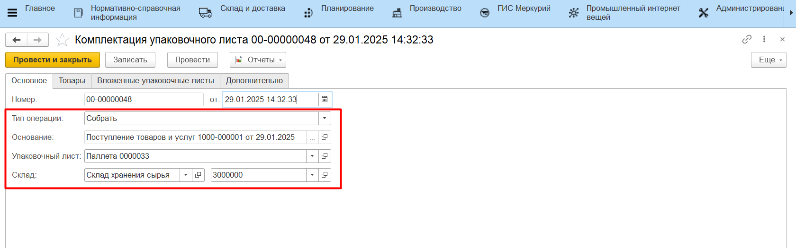

# Приемка по накладным

Приемка от поставщика может осуществляться на киоске через обработку **"Приемка по документам"**. Подробный сценарий описан в разделах [Приемка кусков](../../../Manufacture/Meat/AcceptOfSpicesMeatVegetables/AcceptOfPieceMeat.md) и [Приемка специй и овощей](../../../Manufacture/Meat/AcceptOfSpicesMeatVegetables/AcceptOfSpicesMeat.md). Также приемка по накладным может осуществляться на ТСД. Подробный сценарий описан в разделе [Простой склад - Приемка сырья и материалов по накладным](../../SimpleWarehouse/PriemkaMaterials/PriemkaTSD.md) и в разделе [Адресный склад - Приемка сырья и материалов по накладным](../../AddressWarehouse/PriemkaMaterials/PriemkaTSD.md).

Если при приемке есть необходимость сформировать новый упаковочный лист, в настройках учетной точки должна быть включена опция "Упаковочный лист".

В случае, когда в системе ведется детальный учет по упаковочным листам, по итогу приемки продукции через обработку будет:

- заполнена вкладка "Факт" документа **"Поступление товаров и услуг"**;
- созданы новые документы **"Упаковочный лист"**;
- созданы документы **"Комплектация упаковочного листа"** с типом "Собрать" для каждой паллеты, которые запишут указанные при приемке номенклатурные позиции на созданные упаковочные листы.

Результат приемки также можно проверить отчетами **"Анализ остатков на упаковочных листах"** и **"Местонахождение упаковочных листов"**.

