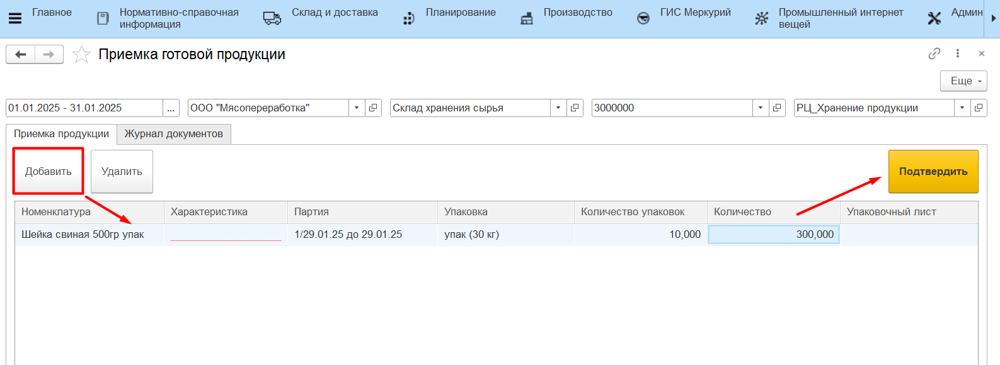
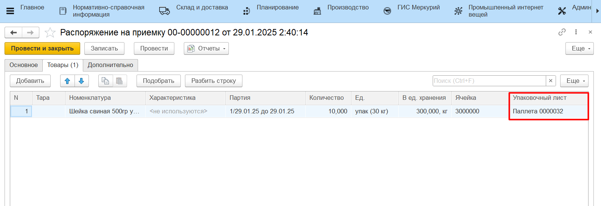
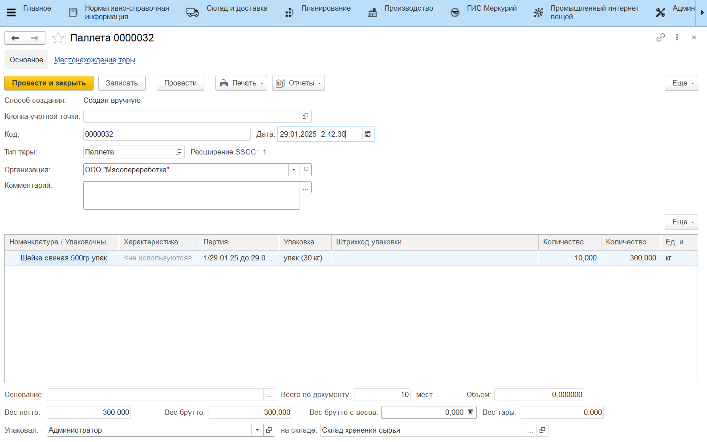
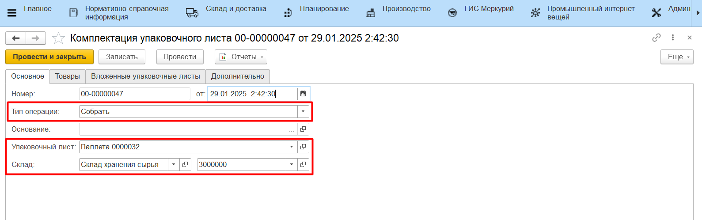

# Приемка продукции из рабочего места

Принимать поступающую готовую продукцию или материалы также можно из рабочего места **"Приемка готовой продукции"** с персонального компьютера кладовщика. Подробнее сценарий приемки рассмотрен в разделе [Приемка готовой продукции с созданием упаковочного листа](../../SimpleWarehouse/Priemka/PriemkaBezYpakLista.md).

В случае, когда в системе ведется детальный учет по упаковочным листам, по итогу приемки продукции через обработку будет сформированы:

- документ **"Распоряжение на приемку"**;
- документ **"Упаковочный лист"**;
- документ **"Комплектация упаковочного листа"** с типом "Собрать", который запишет указанные при приемке номенклатурные позиции на созданный упаковочный лист.

Результат приемки также можно проверить отчетами **"Анализ остатков на упаковочных листах"** и **"Местонахождение упаковочных листов"**.