# Приемка продукции на ТСД

Настройка кнопки учетной точки для приемки на ТСД описана в разделе [Создание и настройка кнопок "Приемка" и "Размещение"](../../AddressWarehouse/Priemka/NastroikaKnopkiPriemka.md).

Опционально в зависимости от схемы работы на складе в настройках учетной точки можно включить или выключить опцию создания новых упаковочных листов. В зависимости от этого параметра будет формироваться разный набор документов при приемке.

## Приемка существующих упаковочных листов

Этот сценарий подойдет в том случае, если перед приемкой отдельной операцией выполнялась сборка паллеты (см. раздел [Паллетирование](../NewPalletMaking.md)), например, паллеты от поставщика сначала расспаллечивают в отдельной зоне, а затем принимают по сформированным упаковочным листам в зоне приемки.

Для этого нужно:

- В настройках кнопки учетной точки выключить опцию "Упаковочный лист";

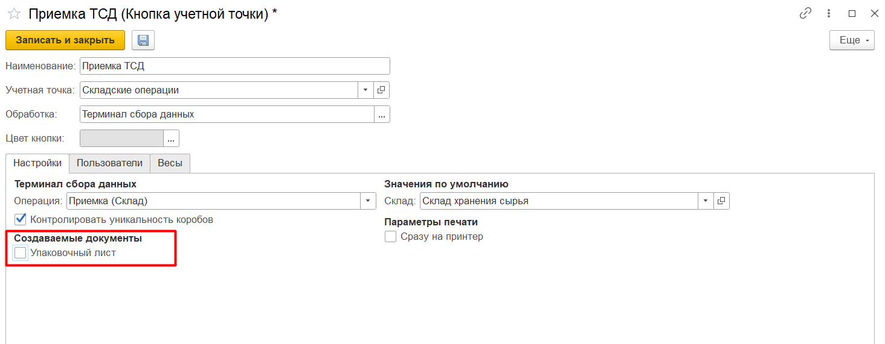

- Зайти в **"Меню учетных точек"**, указать смену и дату смены;
- Зайти в кнопку **"Приемка на ТСД"**;
- В открывшейся форме отсканировать штрихкод упаковочного листа, полученный при предварительном паллетировании. Номенклатура появится на форме. Посмотреть состав отсканированной номенклатуры можно по кнопке **"Состав"**. На форме появится список упаковок/единиц номенклатуры, которые по учету лежат на паллете. Если отсканирована неверная паллета, можно удалить строки с помощью кнопки **"Удалить строку"**.
- Для завершения работы по приемке нужно нажать кнопку **"Завершить"**.

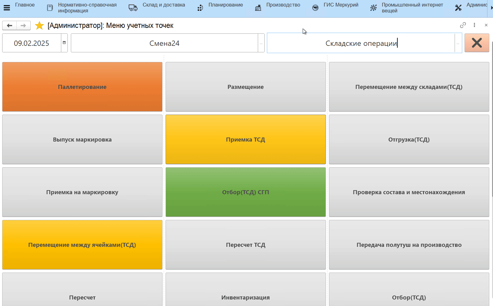

В результате будут созданы:

- документ **"Распоряжение на приемку"**;
- документы **"Комплектация упаковочного листа"** с типом "Пересобрать" для паллет, которые были отсканированы при приёмке. В данном сценарии состав паллет не поменялся, однако был создан документ комплектации, чтобы актуализировать местонахождение паллеты.

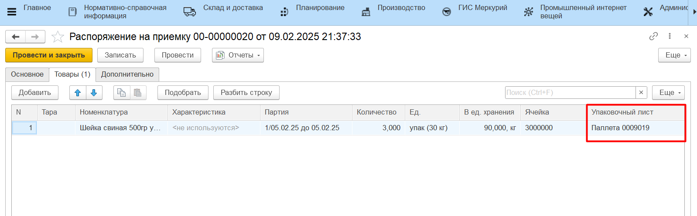
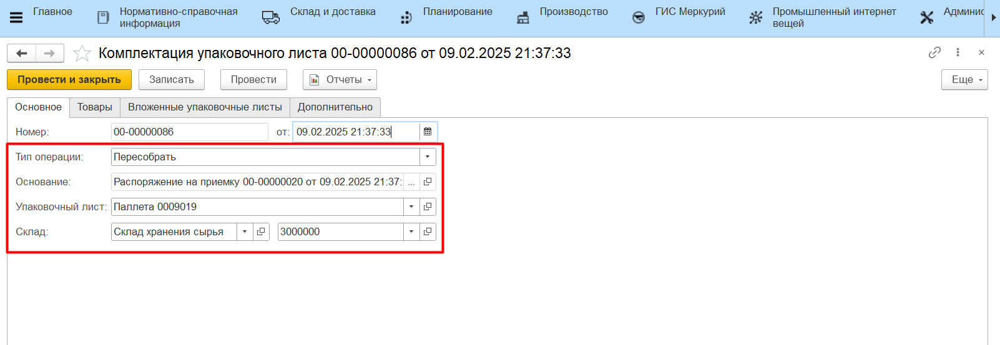
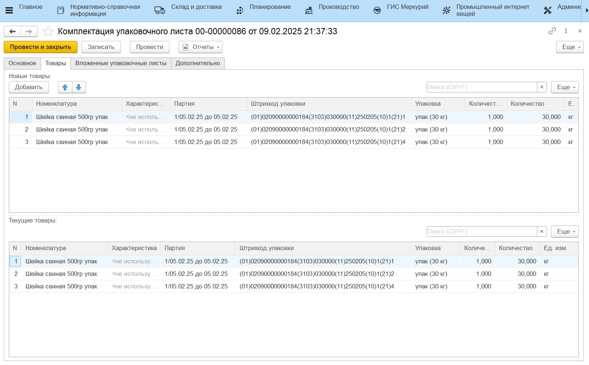

## Приемка с созданием новых упаковочных листов

Этот сценарий подойдет, если продукцию в коробах/упаковках разбирают на паллеты при приемке, либо если при передаче из производства на склад готовой продукции нужно пересчитать состав паллеты и распечатать новый актуальный упаковочный лист.

Для этого нужно:

- В настройках кнопки учетной точки включить опцию "Упаковочный лист";

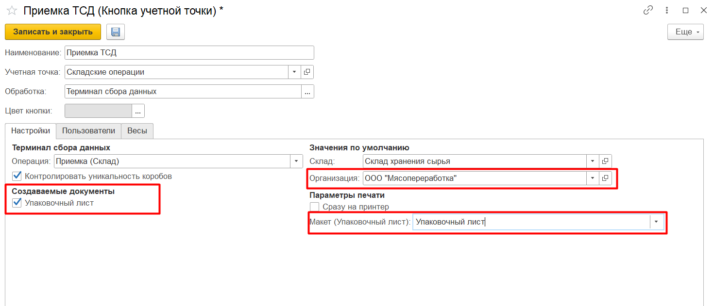

- Зайти в **"Меню учетных точек"**, указать смену и дату смены;
- Зайти в кнопку **"Приемка на ТСД"**;
- В открывшейся форме отсканировать штрихкоды принимаемых коробов (GS1-128). Номенклатура появится на форме:

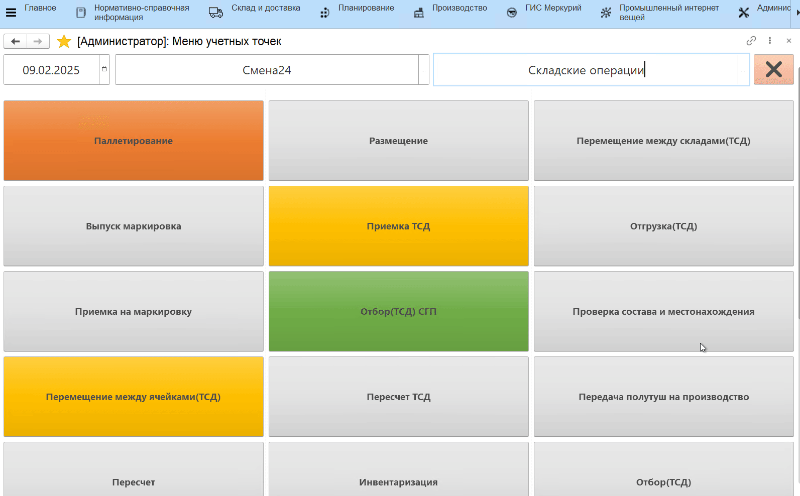

Посмотреть состав отсканированной номенклатуры можно по кнопке **"Состав"**. На форме появится список отсканированных упаковок. Если отсканирована неверные короба, можно удалить строки с помощью кнопки **"Удалить строку"**.

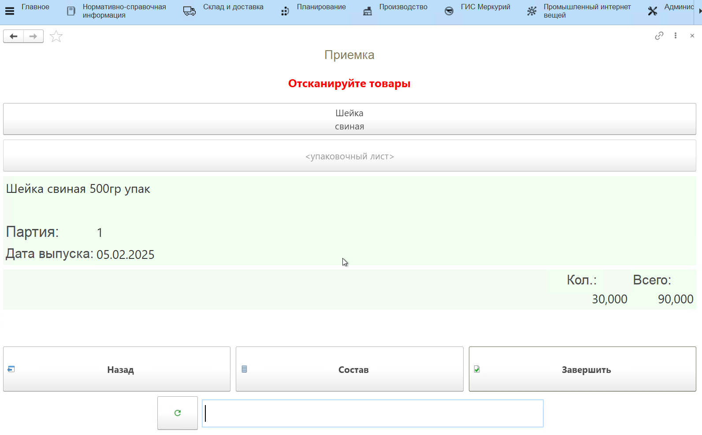

Для завершения работы по приемке нужно нажать кнопку **"Завершить"**.

В результате будут созданы:

- документ **"Распоряжение на приемку"**;
- документ **"Упаковочный лист"**;
- документ **"Комплектация упаковочного листа"** с типом "Собрать", который запишет отсканированные при приёмке короба на созданный упаковочный лист. 

**Одна операция приёмки создает одну паллету!**

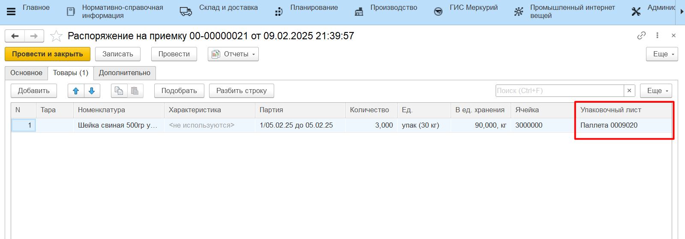
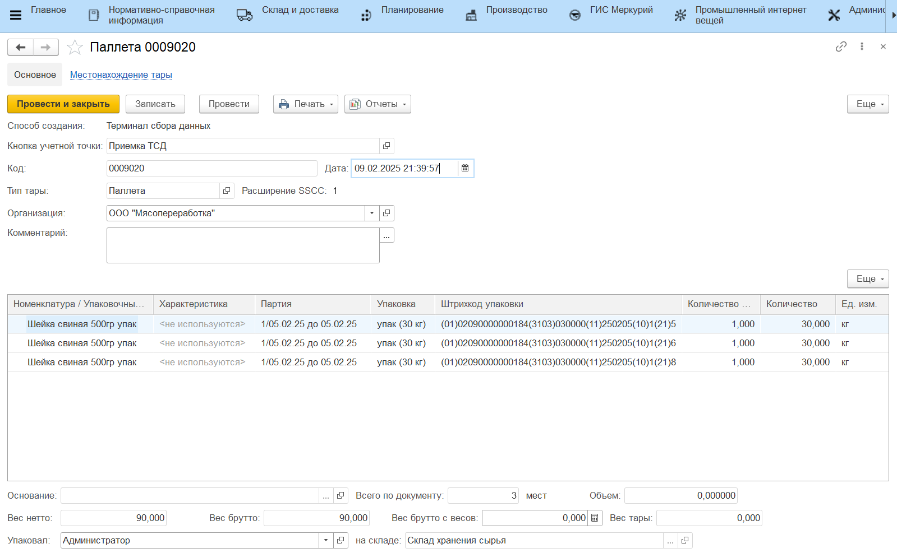
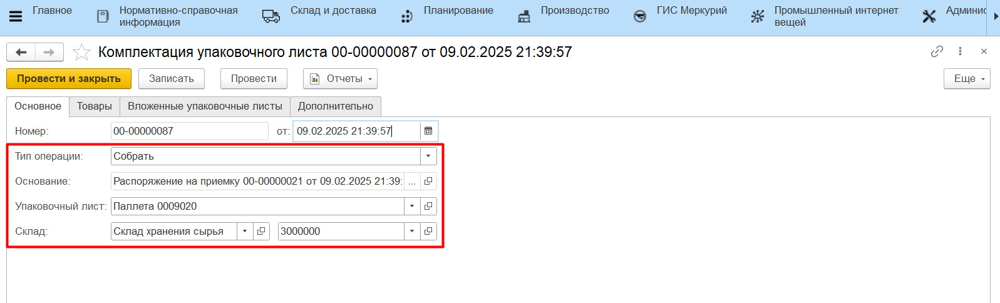

## Приемка с перепаллетированием

В случае, если нужно принять готовую паллету с производства и актуализировать ее состав, можно пройти по сценарию выше и пересчитать все короба на паллете сканированием, сформировав новый упаковочный лист, либо воспользоваться сканированием паллеты. Для этого:

- В открывшейся форме отсканировать штрихкод принимаемого упаковочного листа;
- Отсканировать штрихкоды коробов (GS1-128), которые нужно добавить на паллету. Номенклатура появится на форме;
- Завершить приемку по кнопке **"Завершить"**.

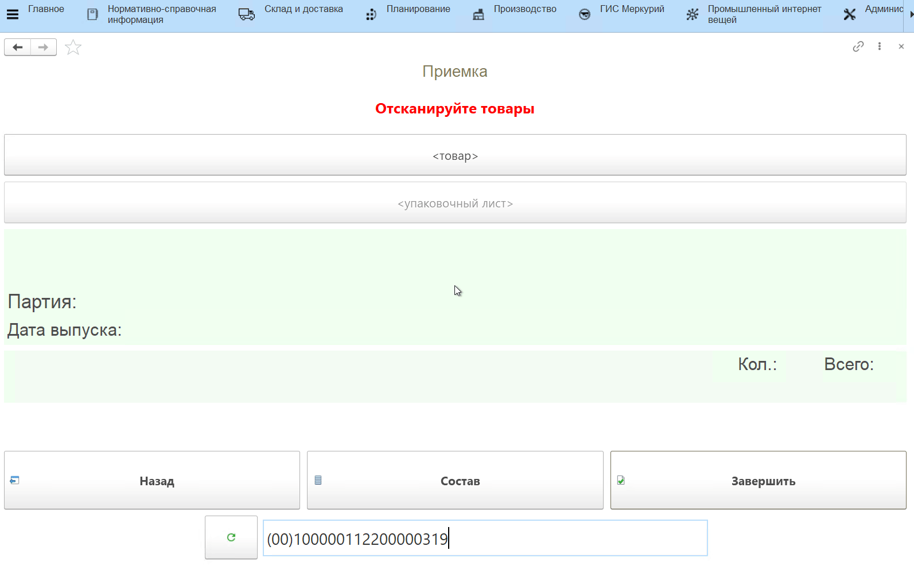

В результате будут созданы:

- документ **"Распоряжение на приемку"**;
- документ **"Упаковочный лист"**;
- документ **"Комплектация упаковочного листа"** с типом "Собрать", который запишет отсканированные при приёмке короба на созданный упаковочный лист;
- документ **"Комплектация упаковочного листа"** с типом "Разобрать" для отсканированной ранее паллеты. 

При этом важно понимать, что разница между двумя упаковочными листами зависнет на складе/ячейке приемки в качестве свободного/отрицательного остатка.

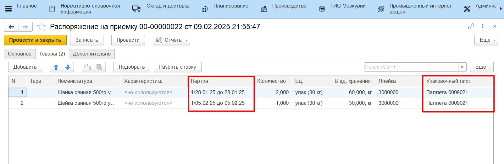
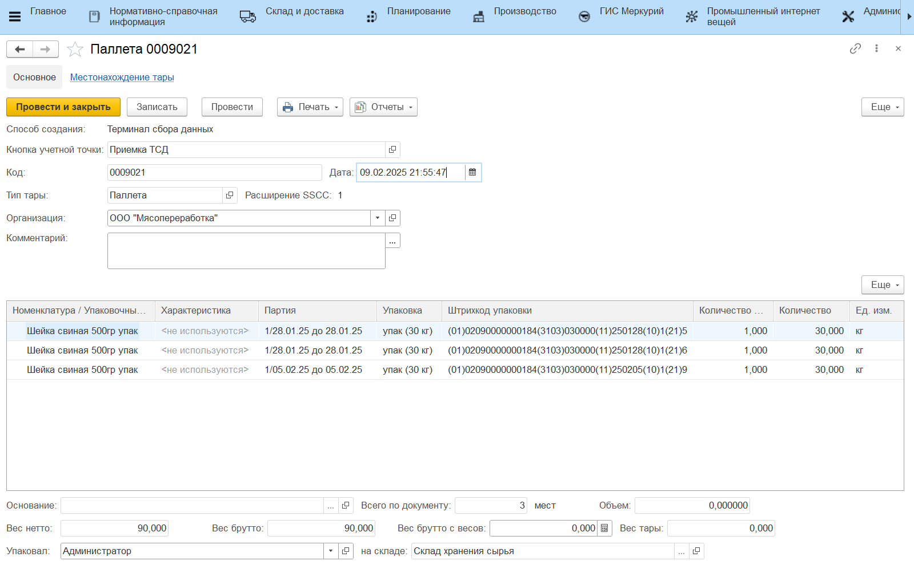
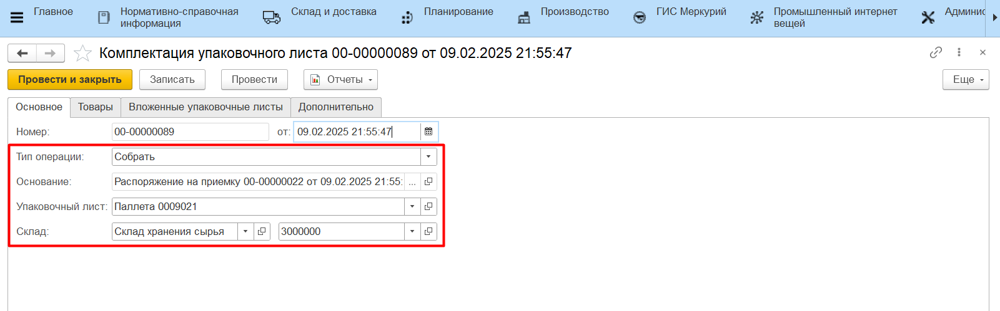
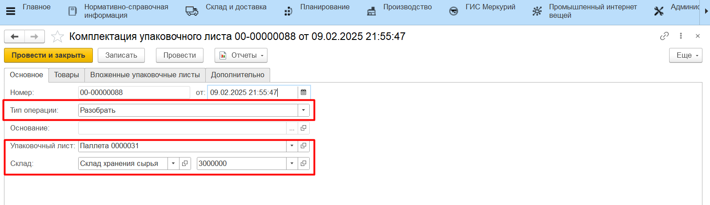