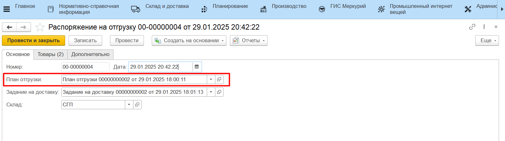
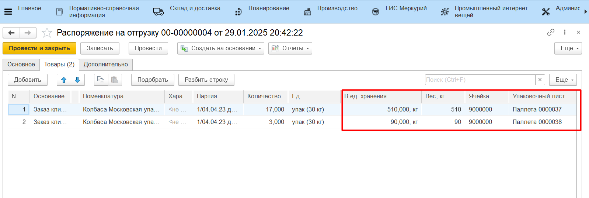
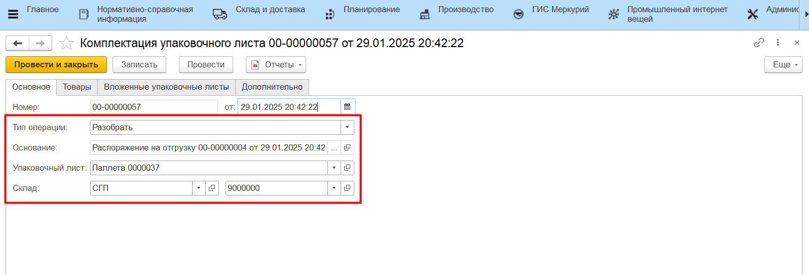
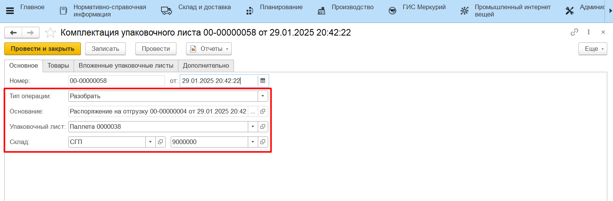
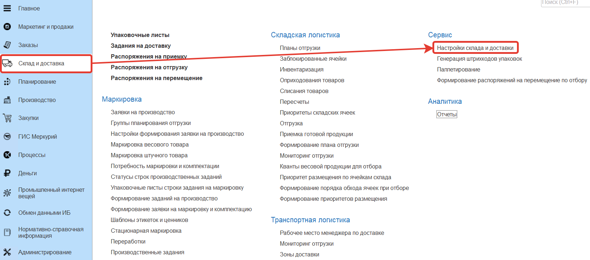
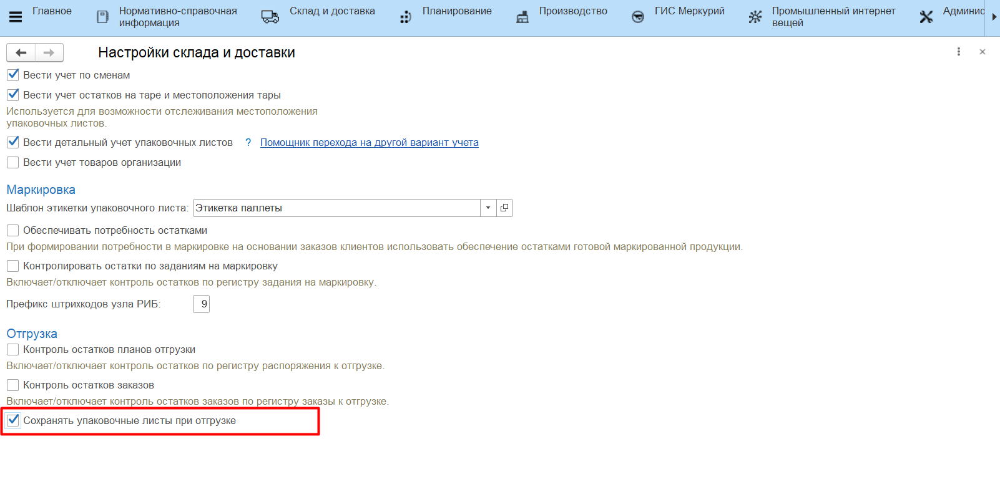

# Отгрузка готовой продукции на ТСД

Настройка кнопки учетной точки для отгрузки на ТСД описана в разделе [Создание и настройка кнопок "Отбор под отгрузку" и "Отгрузка"](../../AddressWarehouse/Otgruzka/NastroikaKnopkiOtgruzka.md).

Подробнее про сценарий отгрузки на ТСД описано в разделе [Отгрузка готовой продукции](../../AddressWarehouse/Otgruzka/OtgruzkaNaTCD.md).

- документ **"Распоряжение на отгрузку"**;
- документы **"Комплектация упаковочного листа"** с типом "Разобрать", которые очистят состав отгруженных упаковочных листов.

При этом, если отгрузка проводится, например, на другой склад собственной организации, и не нужно очищать остатки на упаковочных листах, чтобы после провести по ним приемку, есть возможность включить функцию **"Сохранять упаковочные листы при отгрузке"** в подсистеме **"Склад и доставка"** в разделе **"Сервис"** - **"Настройки склада и доставки"**.

Тогда после завершения отгрузки будет сформирован только документ **"Распоряжение на отгрузку"**, а продукция останется на упаковочных листах.

Результат отгрузки также можно проверить отчетами **"Анализ остатков на упаковочных листах"** и **"Местонахождение упаковочных листов"**.