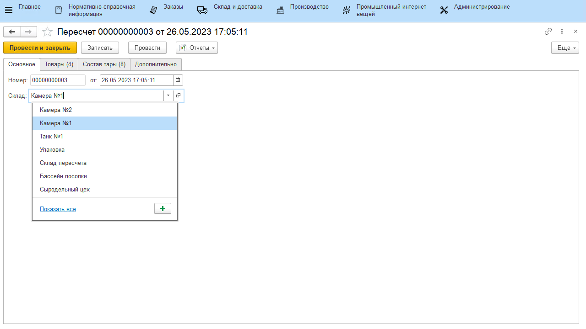
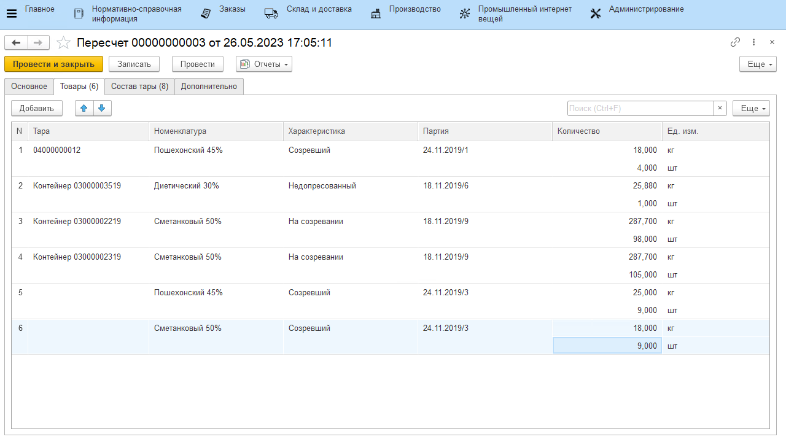
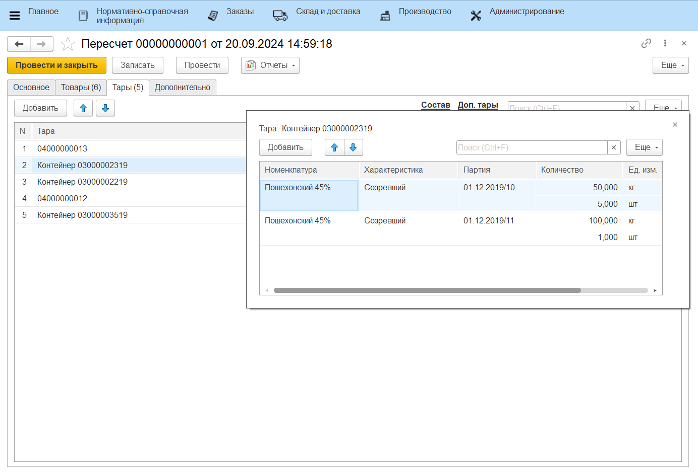
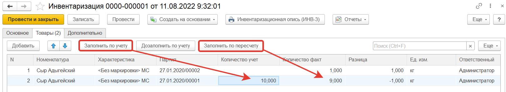
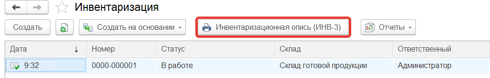
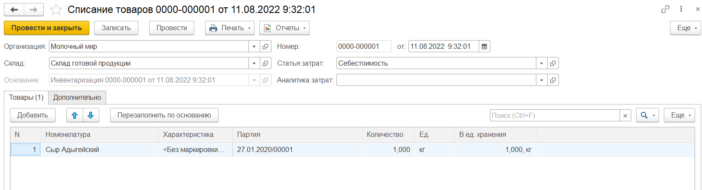
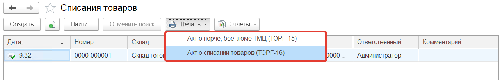
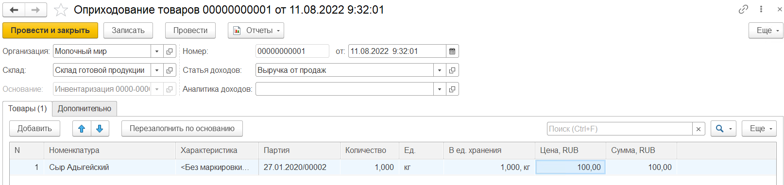

# Инвентаризация

Инвентаризация имущества на складе – это мероприятие в ходе которого проверяется фактическое наличие материально-производственных запасов. Для проведения инвентаризации в системе используется документы **"Пересчет"** и **"Инвентаризация"**, **"Оприходование и списание товаров"**.

Документ **"Пересчет"** - предназначен для отражения фактического количества товаров на складе. Документ **"Инвентаризация"** - предназначен для сравнения количества товаров на складе по учету и количества товаров на складе по факту.

На первом этапе необходимо провести подсчет остатков продукции на складе и занести эти данные в документ **"Пересчет"**, который расположен в разделе **"Склад и доставка"** в подсистеме **"Складская логистика"**.

При создании документа указываются:

На вкладке **"Основное"**:

- Номер - заполняется автоматически
- Дата
- Склад

На вкладке **"Товары"** табличная часть заполняется информацией о том какая номенклатура в каком количестве находится на складе.
Умышленно скорректируем реальные остатки на складе.

Сохраняем документ и переходим к **Инвентаризации**.
Документ **"Инвентаризация"**  расположен в разделе **"Склад и доставка"** в подсистеме **"Складская логистика"**.

При создании документа указываются:

На вкладке **"Основное"**:

- Статус
- Номер - заполняется автоматически
- Дата
- Склад

На вкладке **"Товары"** нажатием кнопки **"Заполнить по учету"** табличная часть будет заполнена товарами, которые имеются на складе по документации.

Далее нажимаем на кнопку **"Заполнить по пересчету"**, откроется форма выбора документов **"Пересчет"**, выбираем на ней нужный документ. В результате в табличной части заполнится поле **"Количество факт"** :

Для документа "Инвентаризация" используется печатная форма: **"Инвентаризационная опись (ИНВ-3)"**

По товарам у которых обнаружена разница между количеством по учету и количеством по факту создаются документы:

**"Списание товаров"** - в случае, когда разница имеет знак минус (т.е. на складе нет данного товара, а по документам он имеется)

Для документа "Списание товаров" используются печатные формы: **"Акт о порче, бое, ломе ТМЦ (ТОРГ-15)"** и **"Акт о списании товаров (ТОРГ-16)"**

 **"Оприходование товаров"** - в случае, когда разница со знаком плюс (т.е. товар на складе имеется, а в документах это не отражено).

