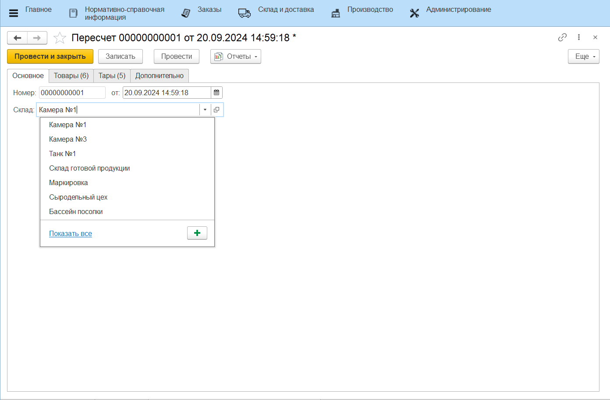
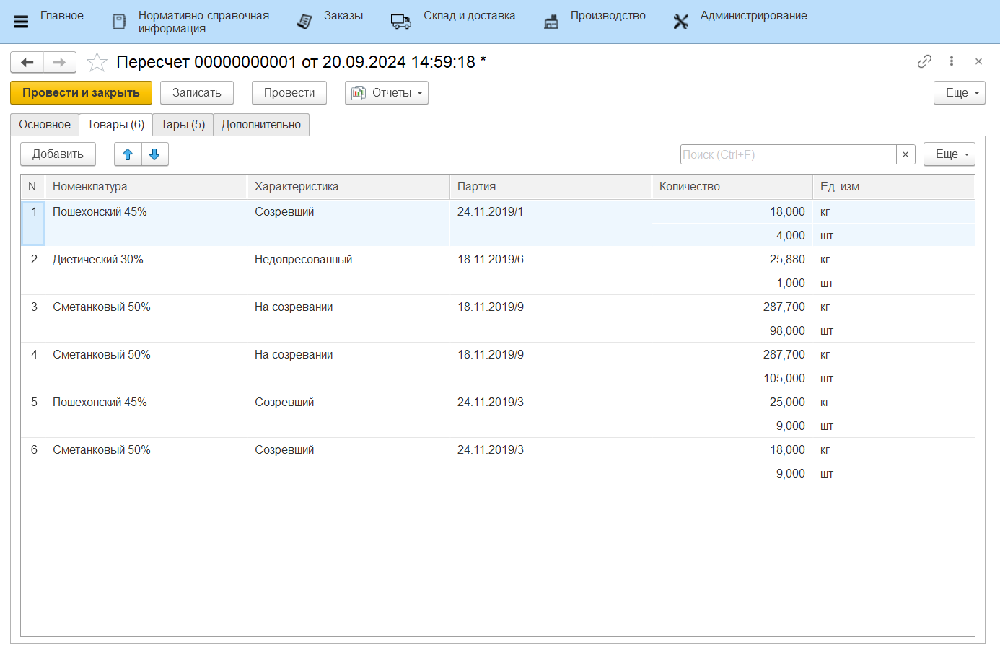

# Инвентаризация

Инвентаризация имущества на складе – это мероприятие в ходе которого проверяется фактическое наличие материально-производственных запасов. Для проведения инвентаризации в системе используется документы **"Пересчет"** и **"Инвентаризация"**, **"Оприходование товаров"** и **"Списание товаров"**.

Документ **"Пересчет"** предназначен для отражения фактического количества товаров на складе. Документ **"Инвентаризация"** предназначен для сравнения количества товаров на складе по учету и количества товаров на складе по факту.

## Проведение пересчета

На первом этапе необходимо провести подсчет остатков продукции на складе и занести эти данные в документ **"Пересчет"**, который расположен в разделе **"Склад и доставка"** в подсистеме **"Складская логистика"**.

При создании документа указываются:

На вкладке **"Основное"**:

- Номер - заполняется автоматически
- Дата
- Склад

На вкладке **"Товары"** табличная часть заполняется информацией о том, какая номенклатура в каком количестве находится на складе.

Если на складе ведется учет по таре, то на вкладке "Тары" указывается тара, которая находится на этом складе. 

- По гипессылке **"Состав"** можно указать продукцию, находящуюся на выбранной таре, а также ее количество.
  

- По гиперссылке **"Доп. тары"** можно указать количество дополнительной тары, если тара составная. Если дополнительной тары на выбранной таре нет, форма останется пустой.
  

## Создание документа "Инвентаризация"

Документ **"Инвентаризация"**  расположен в разделе **"Склад и доставка"** в подсистеме **"Складская логистика"**.

При создании документа указываются:

На вкладке **"Основное"**:

- статус;
- номер - заполняется автоматически;
- дата;
- склад.

На вкладке **"Товары"** по кнопке **"Заполнить"** доступны следующие операции:

- *Заполнить по учету* - табличная часть будет заполнена товарами, которые имеются на складе по документации;
- *Заполнить по пересчету* - табличная часть, заполненная по учету, дозаполняется значениями из документа "Пересчета". Если табличная часть не заполнялась по учету, то нажатием этой кнопки заполнится только значениями из документа "Пересчет";
- *Дозаполнить по учету* - табличная часть, заполненная по пересчету, дозаполняется значениями по учету. 

На вкладке **"Товары"** нажатием кнопки **"Заполнить по учету"** табличная часть будет заполнена товарами, которые имеются на складе по документации.

Далее по нажатию на кнопку **"Заполнить по пересчету"**, откроется форма выбора документов **"Пересчет"**, необходимо выбрать на ней нужный документ. В результате в табличной части заполнятся поля **"Количество факт"** и **"Разница"**.

Для документа **"Инвентаризация"** используется печатная форма: **"Инвентаризационная опись (ИНВ-3)"**

На основании проведенной **Инвентаризация** по кнопке **"Сформировать документы движения остатков"** создаются документы:

- **"Оприходование товаров"** - в случае, когда разница между учетным и фактическим количеством товаров со знаком плюс (т.е. товар на складе имеется, а в документах это не отражено);

- **"Списание товаров"** - в случае, когда разница между учетным и фактическим количеством товаров имеет знак минус (т.е. на складе нет данного товара, а по документам он имеется).

Если на простом складе ведется учет по таре, то процесс проведения инвентаризации с учетом тары описан в разделе ["Пересчет и Инвентаризация продукции с указанием тары"](../InventoryContainers/InventoryContainers.md).