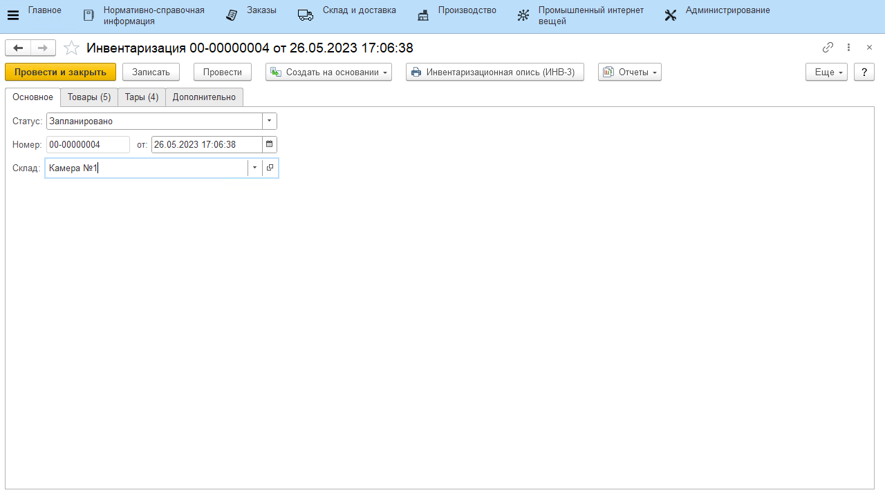

# Инвентаризация

Инвентаризация имущества на складе – это мероприятие в ходе которого проверяется фактическое наличие материально-производственных запасов. Для проведения инвентаризации в системе используется документы **"Пересчет"** и **"Инвентаризация"**, **"Оприходование товаров"** и **"Списание товаров"**.

Документ **"Пересчет"** предназначен для отражения фактического количества товаров на складе. Документ **"Инвентаризация"** предназначен для сравнения количества товаров на складе по учету и количества товаров на складе по факту.

## Проведение пересчета

На первом этапе необходимо провести подсчет остатков продукции на складе и занести эти данные в документ **"Пересчет"**, который расположен в разделе **"Склад и доставка"** в подсистеме **"Складская логистика"**.

При создании документа указываются:

На вкладке **"Основное"**:

- Номер - заполняется автоматически
- Дата
- Склад

На вкладке **"Товары"** табличная часть заполняется информацией о том, какая номенклатура в каком количестве находится на складе. Если на складе ведется учет по таре, то для остатков указывается тара, на которой лежит партия, а так же состав тары на вкладке **"Состав тары"**. "Состав тары" отражает набор дополнительной тары и её вес, который числится на составной таре. 

## Создание документа "Инвентаризация"

Документ **"Инвентаризация"**  расположен в разделе **"Склад и доставка"** в подсистеме **"Складская логистика"**.

При создании документа указываются:

На вкладке **"Основное"**:

- Статус
- Номер - заполняется автоматически
- Дата
- Склад

На вкладке **"Товары"** нажатием кнопки **"Заполнить по учету"** табличная часть будет заполнена товарами, которые имеются на складе по документации.

Далее по нажатию на кнопку **"Заполнить по пересчету"**, откроется форма выбора документов **"Пересчет"**, необходимо выбрать на ней нужный документ. В результате в табличной части заполнятся поля **"Количество факт"** и **"Разница"**.

Если на складе ведется учет по таре, нужно также заполнить вкладку **"Тары"**. Нажатием кнопки **"Заполнить по учету"** табличная часть будет заполнена тарами, которые имеются на складе по документации. 

- По гиперссылке **"Состав"** можно увидеть учетное и фактическое количество продукции на выбранной таре;
- По гиперссылке **"Доп. тары"** можно увидеть учетное и фактическое количество дополнительной тары, если тара составная. Если дополнительной тары на выбранной таре нет, форма останется пустой.

Далее по нажатию на кнопку **"Заполнить по пересчету"**, откроется форма выбора документов **"Пересчет"**, необходимо выбрать на ней нужный документ. В результате в соответствующих гиперссылках заполнятся **"Количество факт"**, **"Вес факт"** и **"Разница"**:

Затем для тары, которая по факту находится на складе и была отсканирована, необходимо проставить галочки **"На месте хранения"**.

Для документа **"Инвентаризация"** используется печатная форма: **"Инвентаризационная опись (ИНВ-3)"**

На основании проведенной **Инвентаризация** создаются документы:

- **"Оприходование товаров"** - в случае, когда разница между учетным и фактическим количеством товаров со знаком плюс (т.е. товар на складе имеется, а в документах это не отражено).

    

- **"Списание товаров"** - в случае, когда разница между учетным и фактическим количеством товаров имеет знак минус (т.е. на складе нет данного товара, а по документам он имеется).

    

- **"Комплектация тары"** - в случае, когда изменился состав тары (по товарам и/или по составу дополнительной тары). Формируются документы по всему перечню тары на вкладке **"Тары"**. Тары, которые по учету находятся на другом складе, но по факту были обнаружены и просканированы на складе инвентаризации, также перемещаются этим документом.

    

- **"Перемещения тар"** - в случае, когда по учету тара находится на складе, а по факту нет. Создается документ **"Распоряжение на перемещение"**, тары, для которых не стоит галочка "на месте хранения", отправляются на склад пересчета. 

    