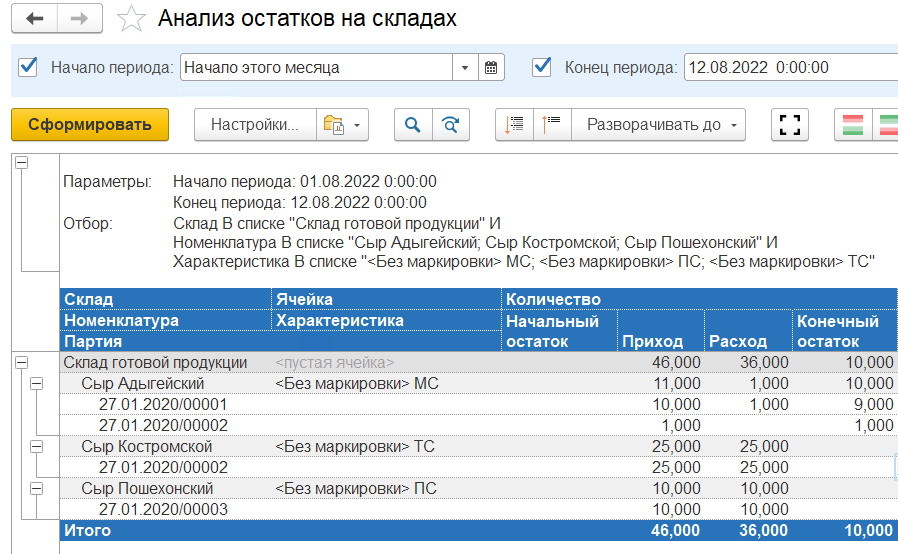

# Отчеты

Для анализа ситуации на складе предусмотрен отчет **"Анализ остатков на складах"**. Он расположен в разделе **"Склад и доставка"** в подсистеме **"Аналитика"** - **"Отчеты"**.

Данный отчет показывает движение товаров на складе в разрезе Номенклатуры и Характеристики. 

Как мы видим в нашем случае:

**"Начальный остаток"** был равен нулю.

**"Приход"** складывается:

Из двух *поступлений* на склад (документ "Распоряжение на приемку")

- Сыр Адыгейский <Без маркировки> Серия 000012 до 01.07.2020 0:00:00 10,000 кг
- Сыр Сулугуни <Без маркировки> Серия 000001 до 15.06.2020 0:00:00 10,000 кг
- Сыр Сулугуни Ашан  Серия 000003 до 19.07.2020 0:00:00	25,000 кг

и *"Оприходования товара"* по результатам инвентаризации

- Сыр Сулугуни <Без маркировки> Серия 000002 до 20.06.2020 0:00:00 1,000 кг

**"Расход"** складывается:

Из двух *отгрузок* (документ "Распоряжение на отгрузку")

- Сыр Адыгейский <Без маркировки> Серия 000012 до 01.07.2020 0:00:00 5,000 кг
- Сыр Сулугуни Ашан  Серия 000003 до 19.07.2020 0:00:00	25,000 кг

*"Перемещения"* (документ "Распоряжение на перемещение")

- Сыр Адыгейский <Без маркировки> Серия 000012 до 01.07.2020 0:00:00 5,000 кг

И *"Списания товара"* по результатам инвентаризации

- Сыр Сулугуни <Без маркировки> Серия 000001 до 15.06.2020 0:00:00 1,000 кг