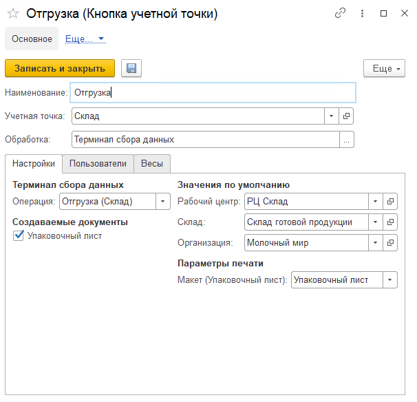

# Создание и настройка кнопки "Отгрузка"

Кнопка **"Отгрузка"** используется для отгрузки со склада готовой продукции.

При создании кнопки учетной точки "Отгрузка" указываются:

- Наименование

- Учетная точка

- Обработка -Терминал сбора данных

На вкладке **"Настройки"** заполняются:

- Операция - Отгрузка (Склад)

- Рабочий центр
  
- Склад

- Возможность создания упаковочного листа, в случае создания заполняются поля организация и макет для печати

На вкладке **"Пользователи"** можно настраивать индивидуальные права доступа.