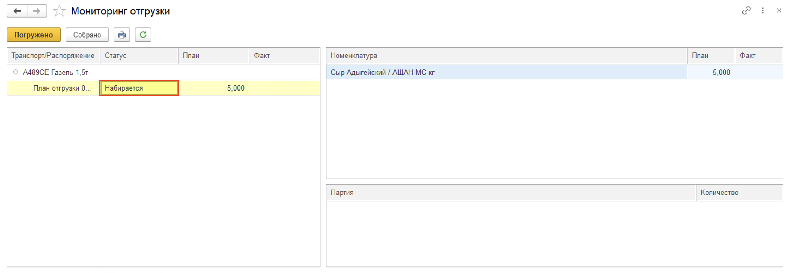
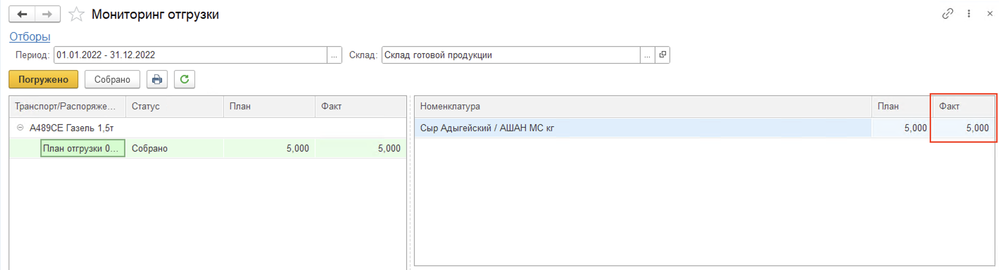

# Отгрузка готовой продукции

Для отслеживания и изменения статусов отгрузок товара со склада используется обработка **"Мониторинг отгрузки"**, которая расположена в разделе **"Склад и доставка"** в подсистеме **"Складская логистика"**.

После открытия обработки заполняются или изменяются следующие поля в верхней части рабочей области в разделе **"Отборы"**:

- Период
- Склад

На форме слева выводятся созданные ранее в системе менеджером по доставке документы **"Задание на доставку"**.

**"Задания на доставку"** создаются на основании **"Планов отгрузки"**. В зависимости от статуса **"Плана отгрузки"** происходят движения товара на складе.

Для реализации примера заранее создадим "Заказ клиента" с параметрами:

- Контрагента: Ашан
- ТЧ Номенклатура:
  - Номенклатура "Сыр Адыгейский"
  - Характеристика "<Без маркировки>"
  - Упаковка: кг
  - Количество: 5

По данному заказу сформируем "План отгрузки" и распределим данный план в "Задание на доставку". 

Так же упакуем данную продукцию на паллет.

Для того, чтобы перевести **"План отгрузки"** в статус **"Набирается"** необходимо распечатать **"План отгрузки"** и передать его на склад. В системе документ переходит в статус **"Набирается"** после нажатия кнопки **"Печать"**. Выбираем созданное нами "Задание на доставку":

После фактической сборки продукции на складе переводим **"План отгрузки"** в статус **"Собрано"**

**Далее отгрузка производится непосредственно на ТСД**

Кнопка **"Отгрузка"** используется для отгрузки со склада готовой продукции.

После открытия формы обработки "Меню учетных точек" заполняем поля:

- Дата
- Смена
- Учетная точка

На форме обработки появятся кнопки выбранной учетной точки, выбираем кнопку **"Отгрузка"**.

На открывшейся форме по нажатию кнопки **"Обновить"**, будут выведены документы **"План отгрузки"**. В списке при помощи кнопок **"Вверх"** и **"Вниз"** переходим к плану отгрузки по которому будем делать отгрузку, нажимаем кнопку **"Выбрать"**.

Далее сканируем штрихкод короба отгружаемой со склада продукции, номенклатура появится на форме. (Вводим в поле "Штрихкод" SSCC код нашего короба)

Посмотреть состав отсканированной номенклатуры можно по кнопке **"Состав"**. На форме появится список номенклатуры, можно удалить строку с помощью кнопки **"Удалить строку"**.

По кнопке **"План/факт"** на форме отображается таблица отгружаемой номенклатуры по плану и по факту.

Для завершения работы по отгрузке нажимаем кнопку **"Завершить"**.

В результате будет заполнен документ **"Распоряжение на отгрузку"**.

Документ **"План отгрузки"** будет переведен в статус **"Собрано"** и в **"Мониторинге отгрузке"** будет отображено фактическое количество.

