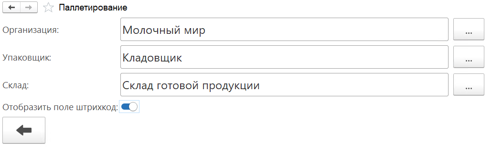
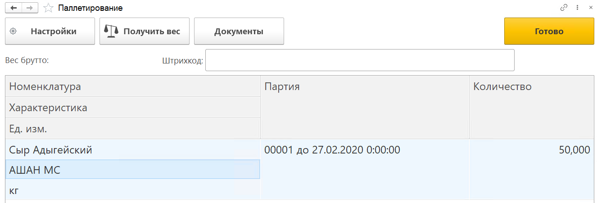
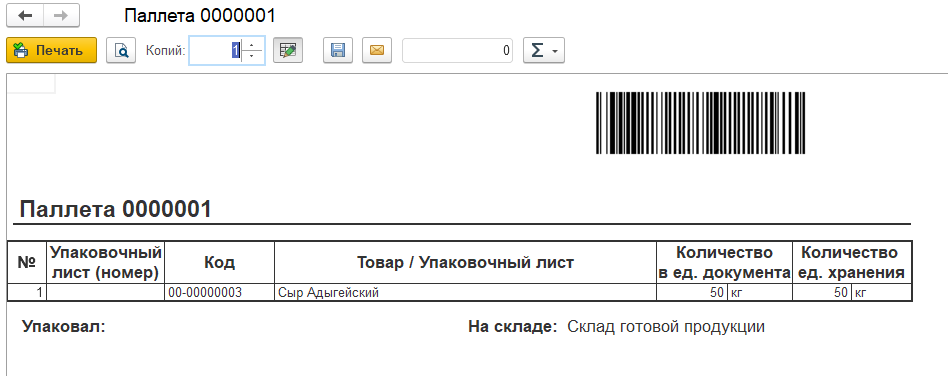
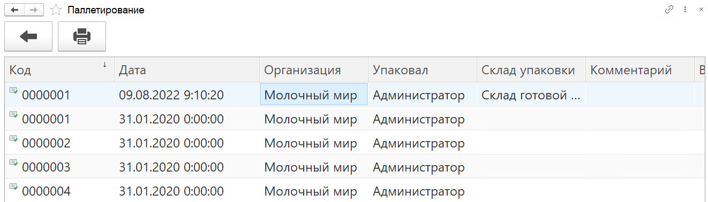
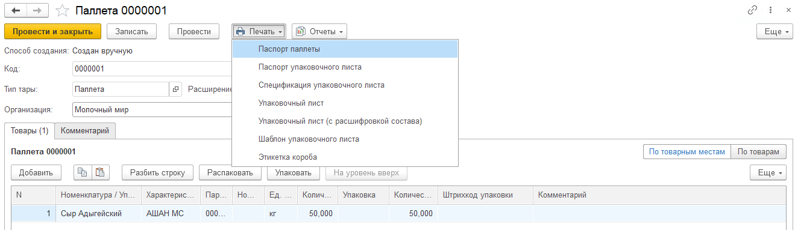
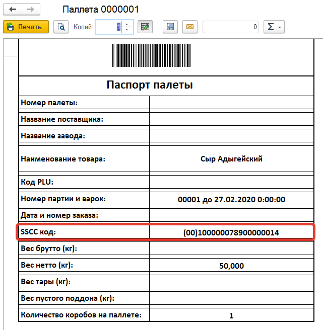

# Паллетирование

Для группировки номенклатуры в паллетные листы на складе используется обработка **"Паллетирование"**, которая расположена в разделе "Склад и доставка" в подсистеме "Сервис".

Перед началом работы необходимо заполнить **Настройки**. Для открытия окна с настройками нажимаем команду Настройки. В открывшемся окне изменяем/заполняем следующие пункты:

- Организация
- Упаковщик
- Склад
- Отобразить поле штрихкод, для ручного ввода штрихкодов

Для возврата в основное окно АРМа нажимаем кнопку 

Для создания **упаковочного листа** необходимо добавить номенклатуру либо отсканировав, либо в ручную указав:

- Номенклатуру
- Характеристику
- Ед. изм.
- Серия
- Количество

Количество строк соответствует количеству позиций в паллете.

Для весового товара при наличии подключенных весов по кнопке **"Получить вес"** количество заполняется автоматически.

После добавление всех позиций номенклатуры нажимаем команду **"Готово"**. В результате будет сформирован новый упаковочный лист, печатная форма Паллеты отобразится на экране

Список всех "Упаковочных листов" можно посмотреть нажав на кнопку **"Документы"**. 

Для повторного вывода печатной формы Паллеты активируем строку и нажимаем кнопку **"Печать"**.

Для открытия "Упаковочного листа" достаточно дважды щелкнуть по необходимому. Упаковочный лист содержит информацию о складе на котором он был упакован, в какой организации и кем, содержит табличную часть с номенклатурой входящей в него. 
Помимо печатной формы паллеты у упаковочного листа существуют еще несколько печатных форм. Посмотреть их список можно нажав на кнопку "Печать".

Нас интересует печатная форма "Паспорт паллеты". А именно код **SSCC**. Данный код используется во всех складских АРМах при добавлении паллетных листов.

Для возврата в основное окно АРМа нажимаем кнопку 