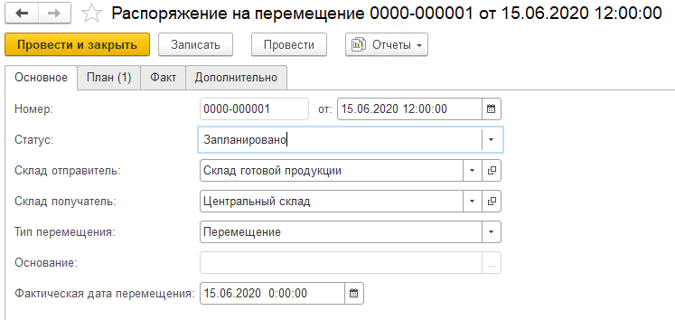

# Создание документа "Распоряжение на перемещение"

Для отражения перемещений товаров между двумя разными складами используется документ **"Распоряжение на перемещение"**.
 
При создании документа указываются:
 
На вкладке **"Основное"**:

- Номер - заполняется автоматически
- Дата
- Статус: 
    - запланировано 
    - к выполнению. В данном статусе распоряжения доступны для работы на ТСД
    - выполняется
    - выполнено
- Склад-отправитель
- Склад-получатель
- Тип перемещения: Перемещение
- Фактическая дата перемещения

На вкладке **"План"** табличная часть заполняется информацией о том какую номенклатуру планируется перемещать данным распоряжением.

На вкладке **"Факт"** табличная часть заполняется информацией о том какую номенклатуру данным распоряжением переместили. Заполняется автоматически при перемещении на ТСД.