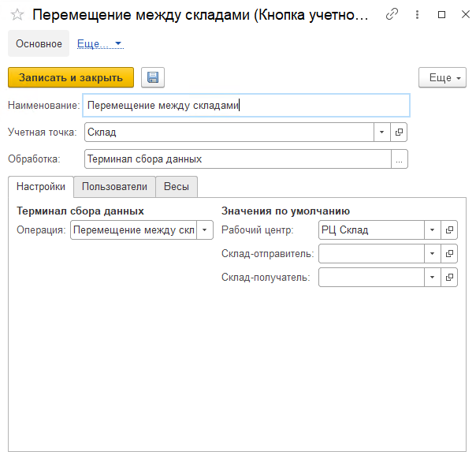

# Создание и настройка кнопки "Перемещение" 

Кнопка **"Перемещение между складами"** используется для перемещения готовой продукции со склада на другой склад.
 
При создании кнопки учетной точки **"Перемещение между складами"** указываются:

- Наименование

- Учетная точка

- Терминал сбора данных
 
На вкладке **"Настройки"** заполняются:

- Операция - Перемещение между складами (Склад)

- Рабочий центр

- Склад-отправитель

- Склад-получатель - если указан, перемещение будет осуществляться только на этот склад, для перемещения на другой склад необходимо будет создать отдельную кнопку

На вкладке **"Пользователи"** можно настраивать индивидуальные права доступа.
