# Создание "Заказа на перемещение"

После того как сформирован документ **"Производственное задание"** (его может сформировать мастер смены вручную или все документы на смену могут быть сформированы через обработку **"Пооперационное планирование"**) кладовщику необходимо передать материалы под производство со складов хранения материалов. Для этого мастер смены должен проанализировать потребность в материалах и сделать заказ на склад-отправитель. 

## Формирование документа "Заказ на перемещение"

Документ **"Заказ на перемещение"** формируется на основании документа **"Производственное задание"**. Для этого нужно:

- выбрать документ **"Производственное задание"**;
- перейти к созданию на основании;

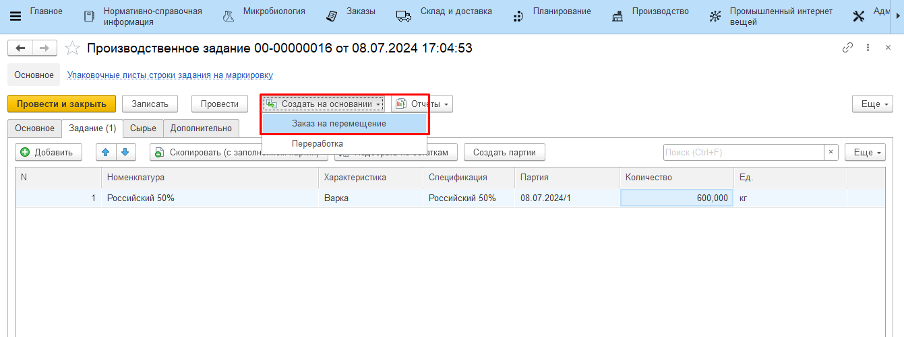

- в открывшемся документе указать склад-отправитель (склад, с которого планируется перемещение материалов). При этом для отражения передачи с разных складов нужно сформировать разные документы. Например, один документ на заказ со склада хранения сырья, второй документ на заказ со склада хранения вспомогательных материалов; 
- указать склад-получатель. Список складов-получателей ограничен списком складов рабочего центра, к которому относится производственное задание;
- указать дату отгрузки и дату доставки. При этом они не могут быть больше, чем дата смены из производственного задания.

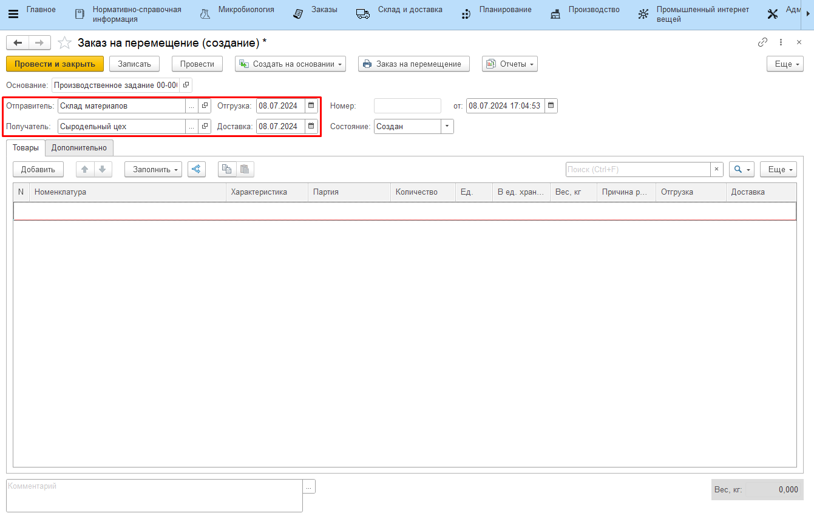

## Автоматический подбор материалов к заказу

В системе предусмотрена возможность автоматически подбирать материалы к заказу. При подборе учитывается:

- спецификация и объем выпуска из производственного задания - по ним считается нормативная потребность в материалах для выполнения производственного задания;
- остатки на складе-получателе - по ним считается фактическая потребность в материалахах. Если материалов на складе-получателе хватает и нет необходимости заказывать еще, то автоматиечки материалы подобраны не будут;
- склад-отправитель, указанный в шапке документа, и склады из регистра ["Склады хранения номенклатуры"](../../../../CommonInformation/KindOfNomenclature.md) - будут подобраны только те материалы, для которых склад-отправитель и склад хранения совпадают, и те материалы, для которых склад хранения не указан (считается, что любой).

Автоматический подбор выполняется по кнопке **"Подобрать всё (по спецификации)"**. Автоматически материалы подбираются без партий. Если у мастера есть необходимость заказать конкретную партию материала, добавить партию можно вручную. 

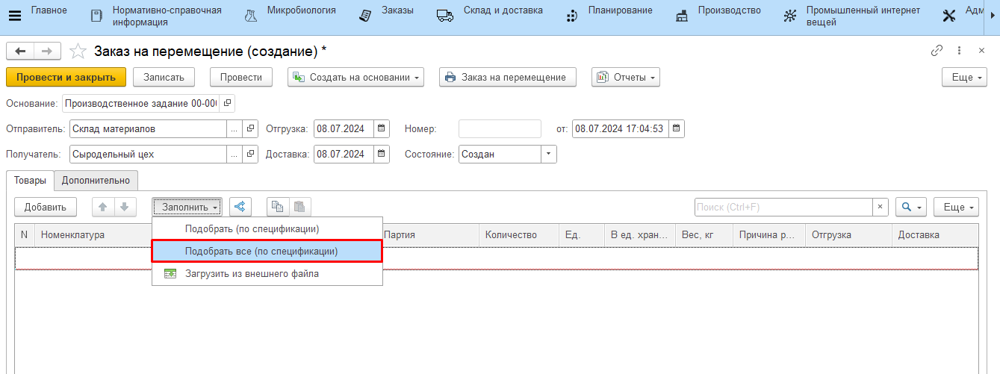
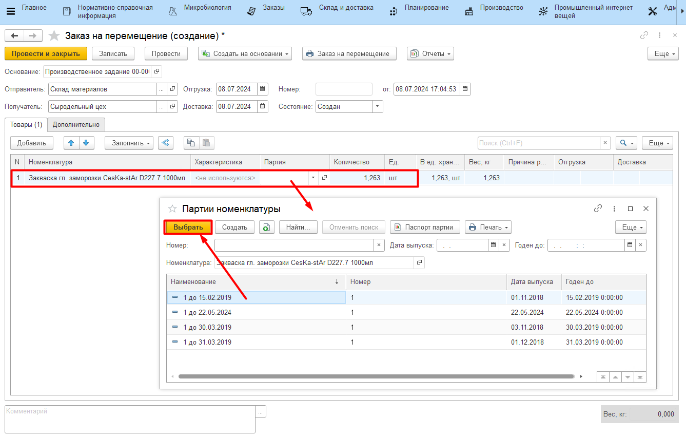

## Подбор материалов вручную

Кроме автоматического подбора материалов по спецификации в системе предусмотрена возможность подбора с точностью до партий и с учетом текущих остатков. Подбор выполняется по кнопке **"Подобрать (по спецификации)"**.

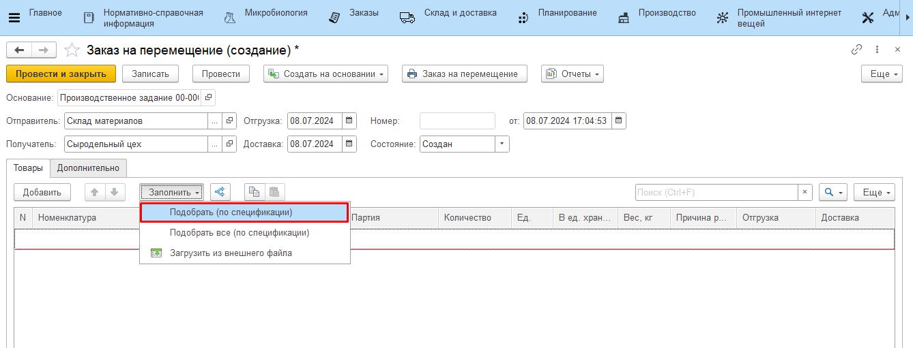

В открывшейся форме:

- видно, какие материалы нужно заказать под производственное задание (с учетом соответствия склада-отправителя и склада хранения, см. выше);

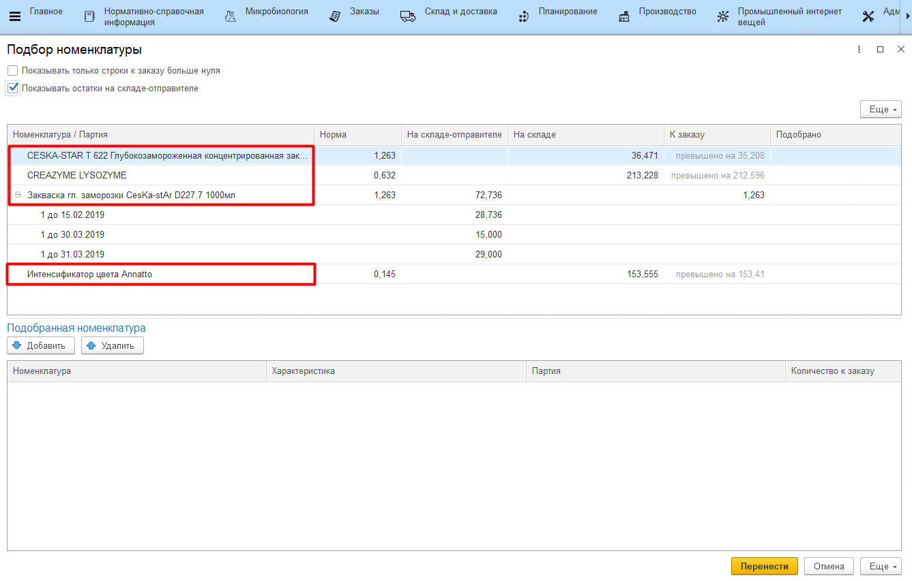

- видно, какое количество материала уже есть на складе-получателе;

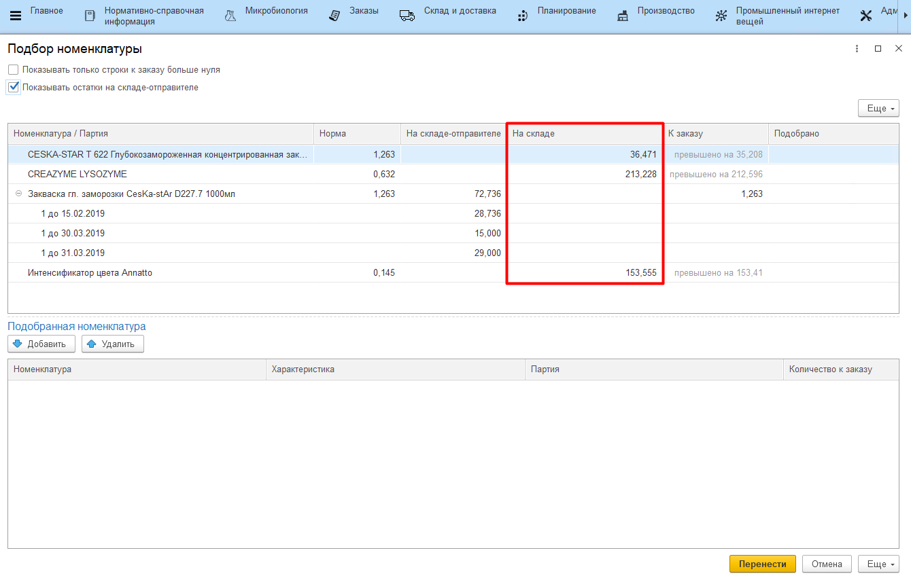

- рассчитано нормативное количество - нормативная потребность в материалах для выполнения производственного задания;

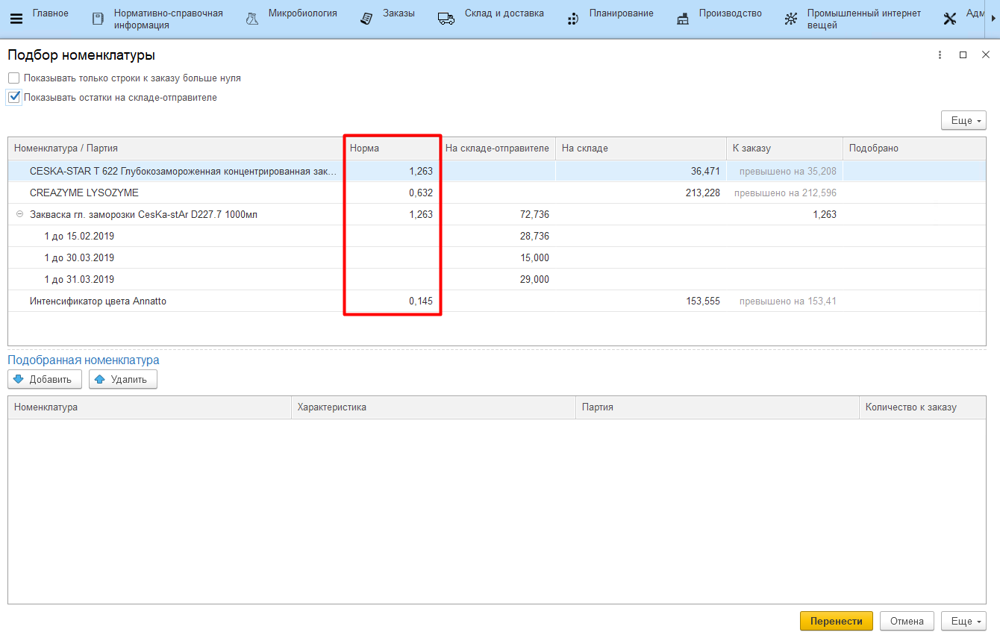

- рассчитано количество к заказу - фактическая потребность в материалах для выполнения производственного задания (считается как разница между текущим остатком на складе-получателе и нормативным количеством);

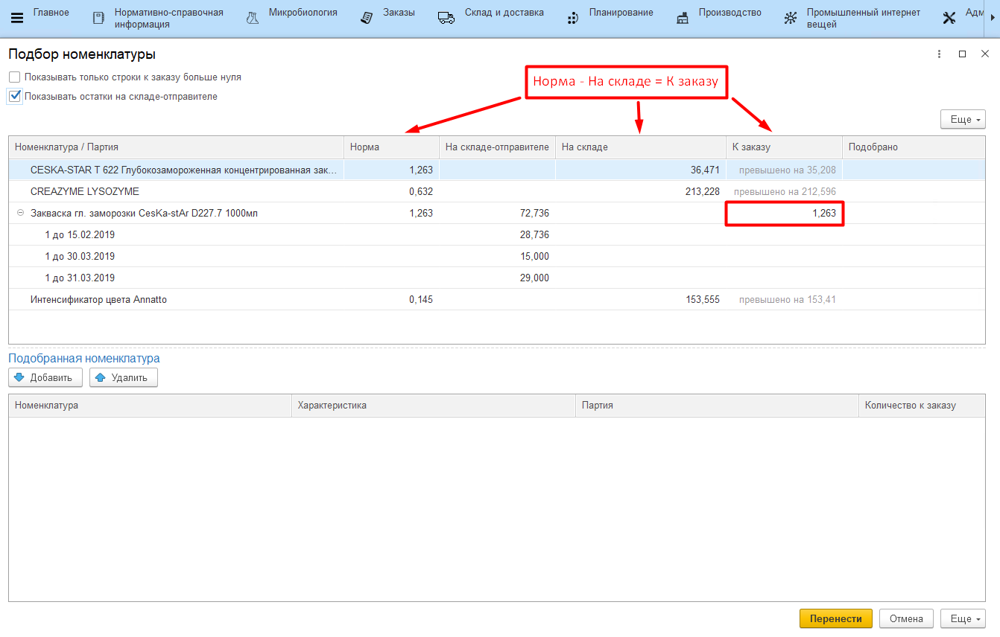

- можно посмотреть остатки на складе-отправителе и заказать конкретную партию из остатков склада;

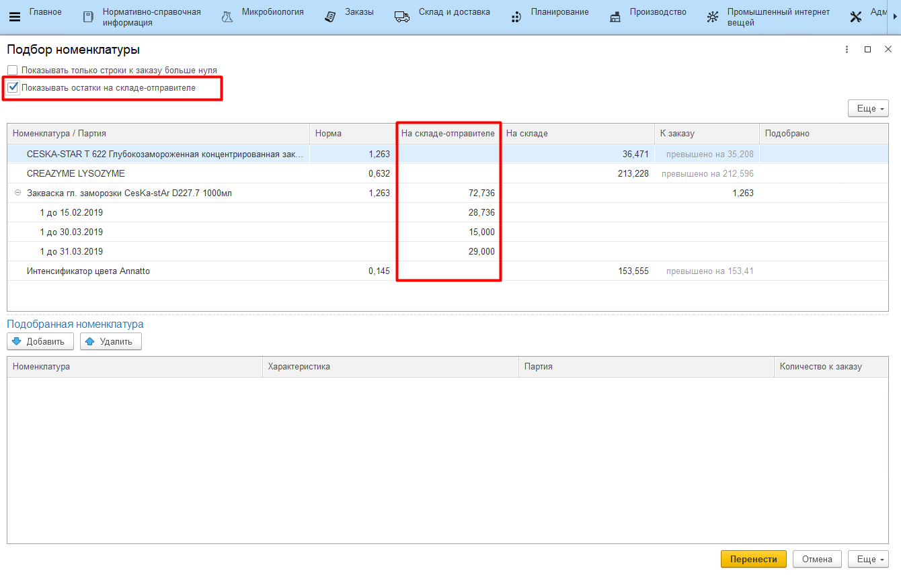

- можно скрыть строки материалов, которые не требуются к заказу (остатков на складе-получателе хватает).

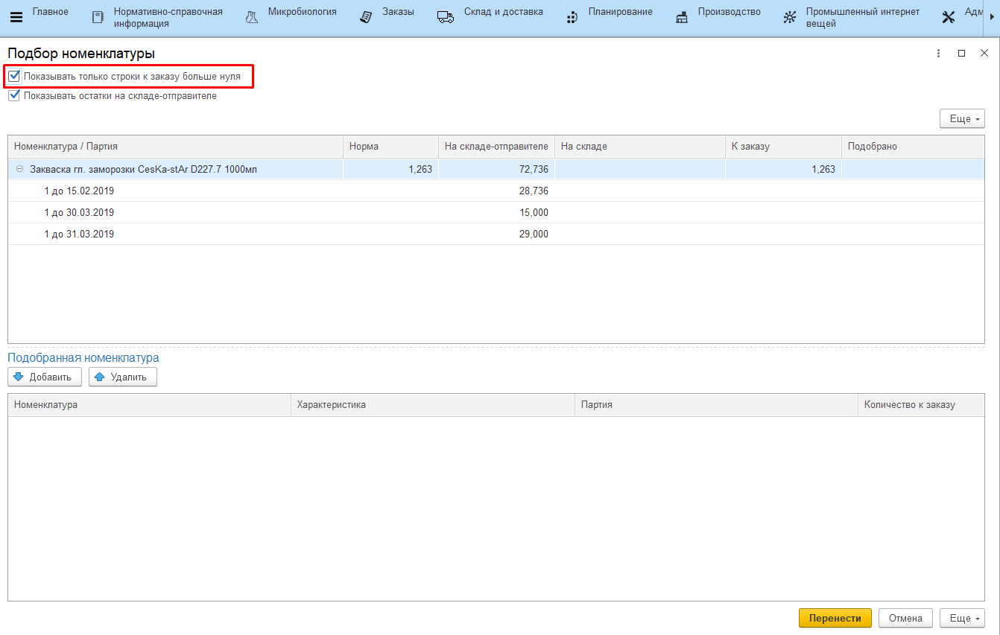

Форма работает по принципу корзины. В корзину можно добавлять номенклатуру (либо номенклатуру в разрезе конкретных партий) и указывать количество к заказу. После нажатия кнопки **"Перенести"** корзина будут перенесена в табличную часть документа **"Заказ на перемещение"**.

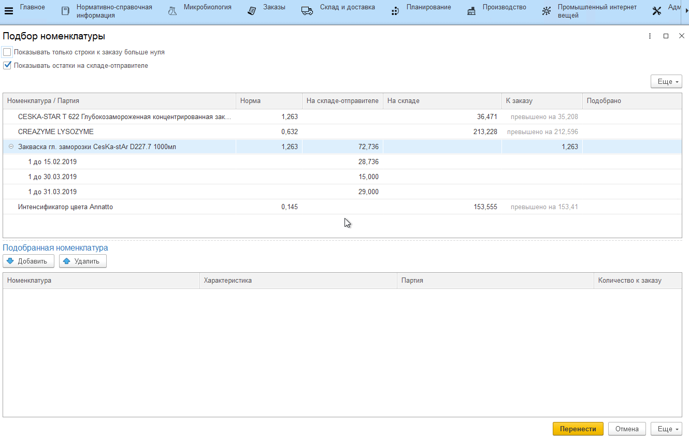

Затем документ необходимо провести и закрыть.