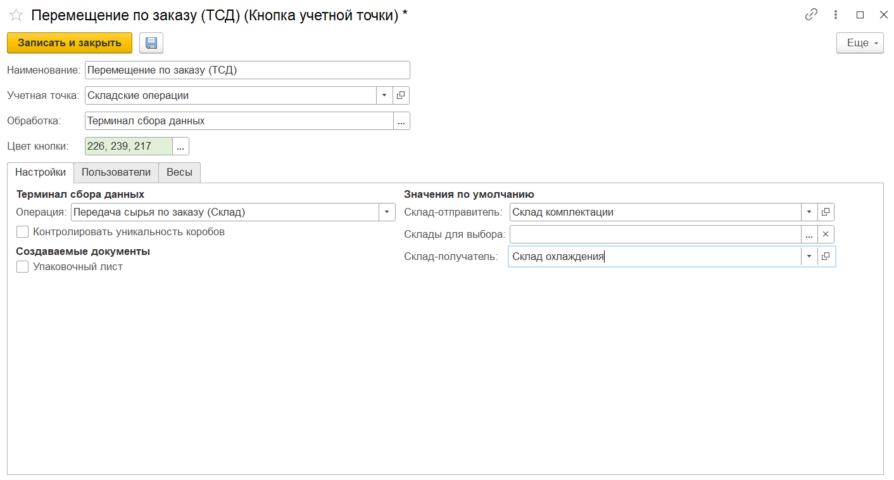

# Настройка кнопки "Перемещение по заказам ТСД"

Кнопка **"Перемещение по заказам на перемещение (ТСД)"** используется используется для передачи материалов между складами материалов и складами производства.

При создании кнопки учетной точки **"Перемещение по заказам на перемещение (ТСД)"** указываются:

- Наименование;
- Учетная точка;
- Обработка - Терминал сбора данных;

На вкладке **"Настройки"** заполняются:

- Операция - Передача сырья по заказу (Склад);
- Склад-отправитель;
- Склад-получатель;
- Ячейка-получатель, если склад адресный (если не заполнена, по умолчанию будет взята ячейка приемки);
- Склады для выбора - ограничивает список выбора для склада-отправителя и склада-получателя. При пустом поле ограничений нет. Если указаны склады по умолчанию, то будут взяты они, игнорируя список складов для выбора;
- Возможность создания упаковочного листа - если включена, по итогу перемещения будут создаваться новые упаковочные листы;
- Организация и макет для печати.

