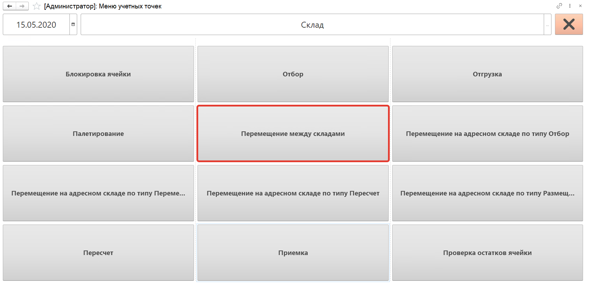
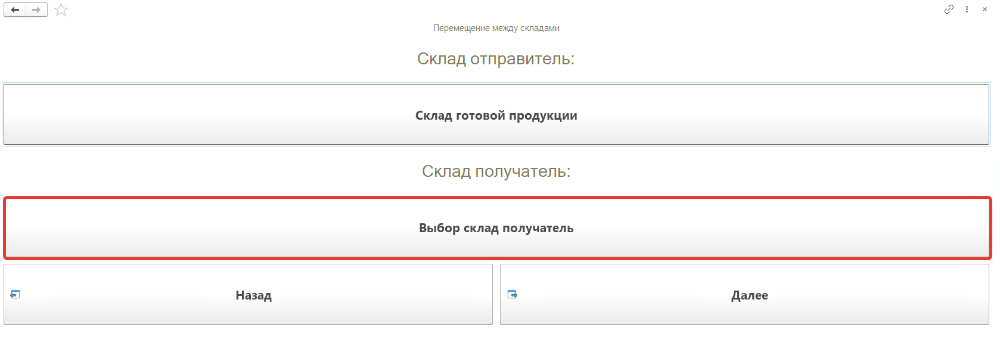
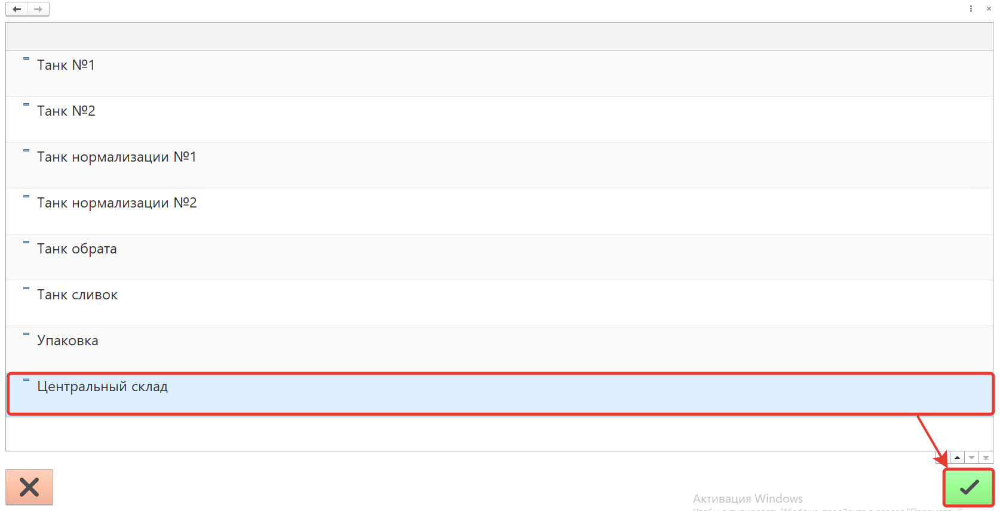
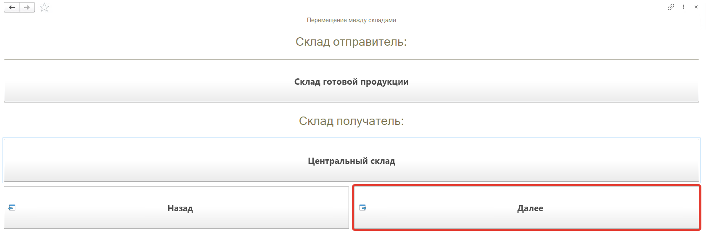
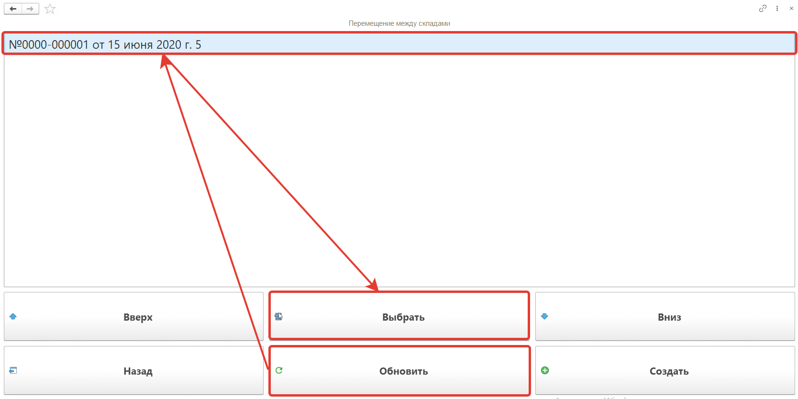
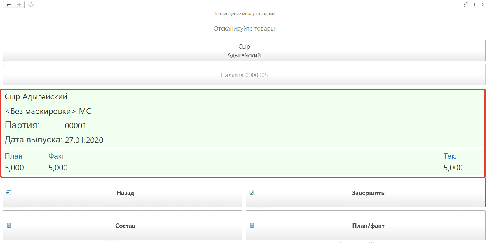
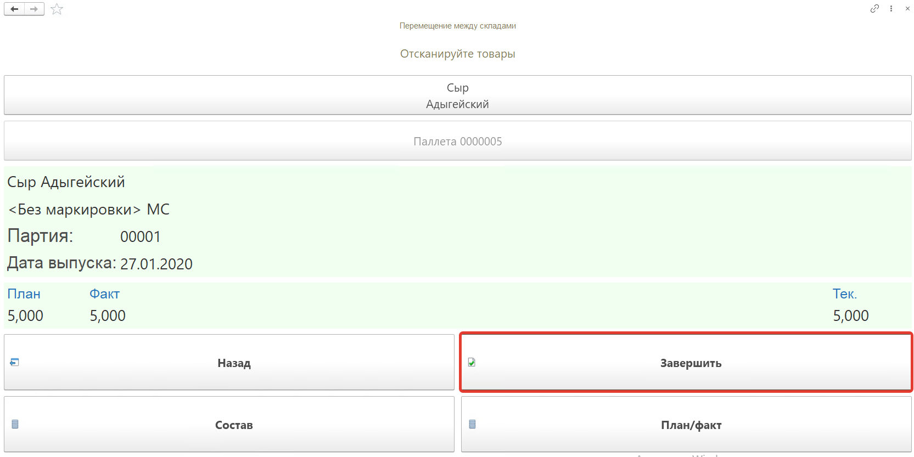
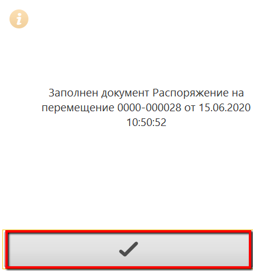
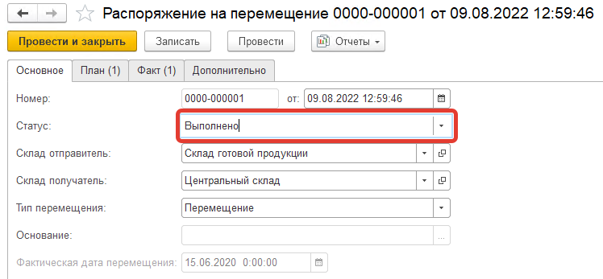
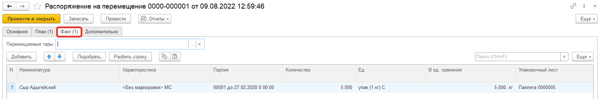

# Перемещение м/д складами на ТСД

Кнопка **"Перемещение между складами"** используется для перемещения готовой продукции со склада на другой склад.

После открытия формы обработки **"Меню учетных точек"** заполняем поля:

- Дата
- Смена
- Учетная точка

На форме обработки появятся кнопки выбранной учетной точки, выбираем кнопку **"Перемещение между складами"**.

На открывшейся форме выбираем **"Склад-получатель"**, это поле может быть заполнено автоматически, если кнопка была создана для перемещения продукции на конкретный склад.

Выбираем из списка склад на который будет происходить перемещение и нажимаем на кнопку **"V"**.

Нажимаем кнопку **"Далее"**.

На открывшейся форме надо нажать кнопку **"Обновить"**, будут выведены **"Распоряжения на перемещения"** с типом **"Перемещение"** в статусе **"К выполнению"** для выбранных складов. В списке при помощи кнопок **"Вверх"** и **"Вниз"** переходим к распоряжению по которому будем делать перемещение, нажимаем кнопку **"Выбрать"**.  С помощью кнопки **"Создать"** можно создавать новые распоряжения на перемещение.

Выбираем созданное ранее перемещение.

Далее сканируем штрихкод перемещаемого короба, номенклатура появится на форме. Появится количество отгружаемого товара по плану и по факту.

Создадим для этого паллет в составе которого "Сыр Адыгейский" с характеристикой <Без маркировки>, 5 кг.

Для завершения перемещения нажимаем кнопку **"Завершить"**.

Нажимаем кнопку **"V"**

В  **"Распоряжении на перемещение"** заполнится вкладка **"Факт"** и документ будет переведен в статус **"Выполнено"**.

