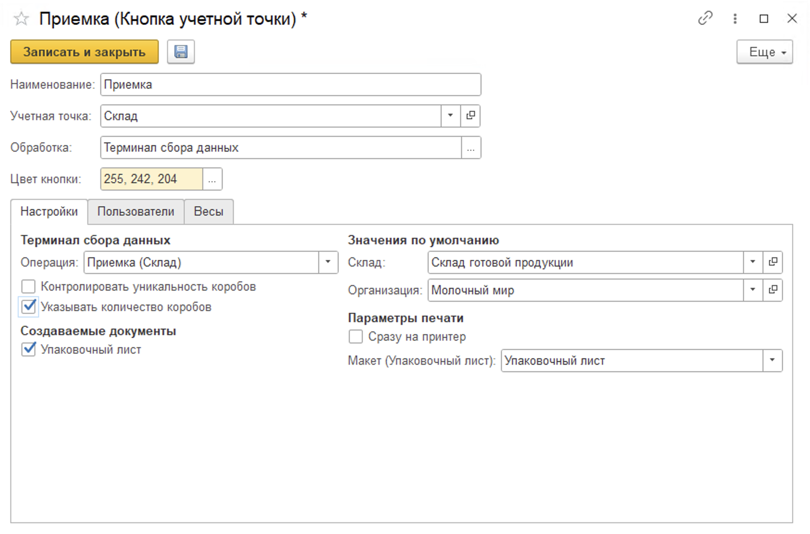
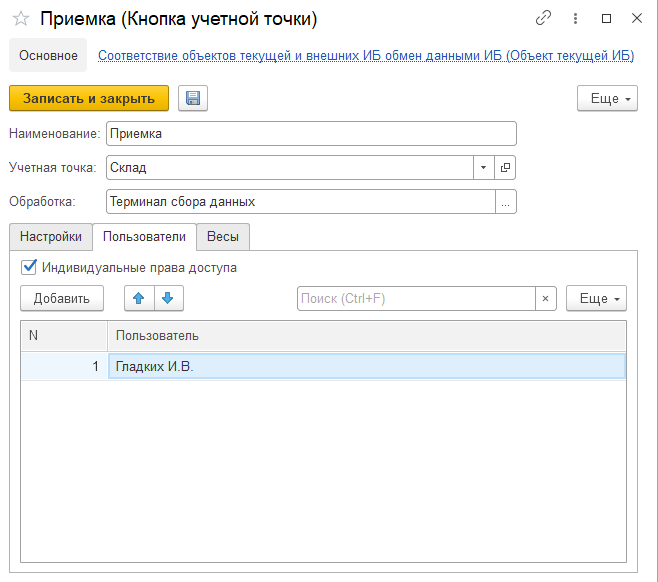

# Создание и настройка кнопки "Приемка" 

Кнопка **"Приемка"** используется для приема на склад готовой продукции.

При создании кнопки учетной точки **"Приемка"** указываются:

- Наименование;
  
- Учетная точка;
  
- Обработка -Терминал сбора данных;

- Цвет кнопки в МУТ.

На вкладке **"Настройки"** заполняются:

- Операция - Приемка (Склад);
  
- Склад;
  
- Возможность создания упаковочного листа, в случае создания заполняются поля организация и макет для печати.

А также функциональные опции:

- Контролировать уникальность коробов;

- Указывать количество коробов. Данная настройка позволит указывать количество коробов к отбору после сканирования кода GS1-128.
  

На вкладке **"Пользователи"** можно настроить индивидуальные права доступа на данную команду.

