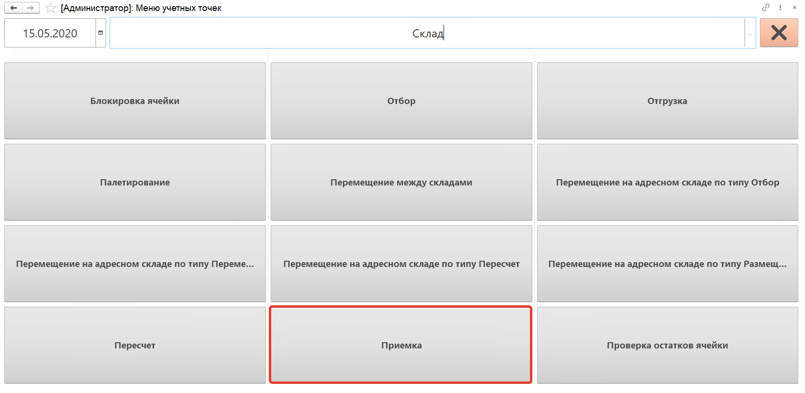
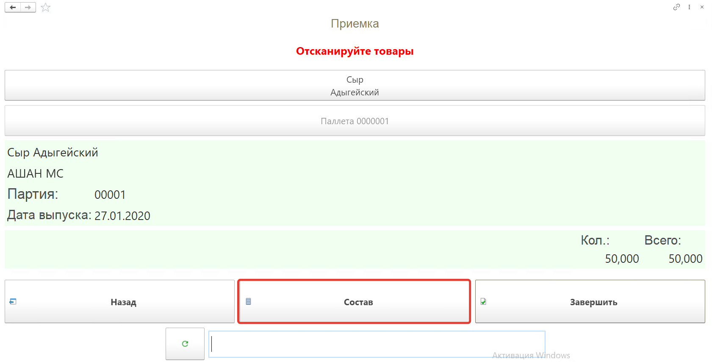
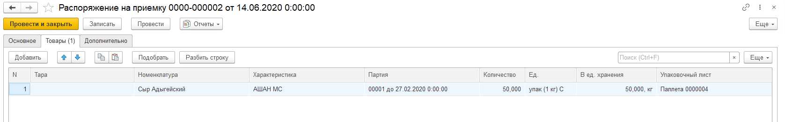

# Приемка готовой продукции на ТСД

Кнопка **"Приемка"** используется для приема на склад готовой продукции.
 
После открытия формы обработки **"Меню учетных точек"** заполняем поля:

- Дата
  
- Смена
  
- Учетная точка
  
- Сканируем штрихкод сотрудника, если были установлены Индивидуальные права доступа

Установим: 

- Дата: 15.05.20
  
- Смена: Смена 24
  
- Учетная точка: Основной склад

На форме обработки появятся кнопки выбранной учетной точки, выбираем кнопку **"Приемка"**.

Далее сканируем штрихкод короба поступившей на склад продукции, номенклатура появится на форме.

Посмотреть состав отсканированной номенклатуры можно по кнопке **"Состав"**.

На форме появится список номенклатуры, можно удалить строку с помощью кнопки **"Удалить строку"**.

Для завершения работы по приемке нажимаем кнопку **"Завершить"**.

В результате будет создан документ **"Распоряжение на приемку"**.

