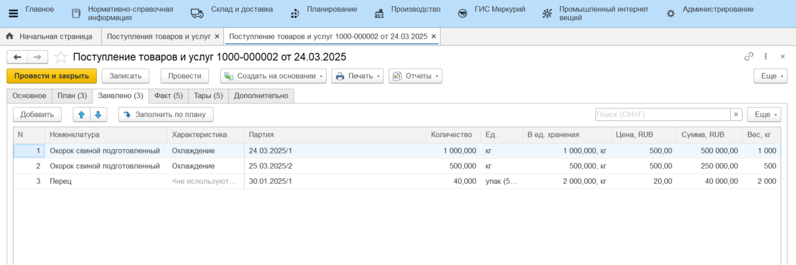
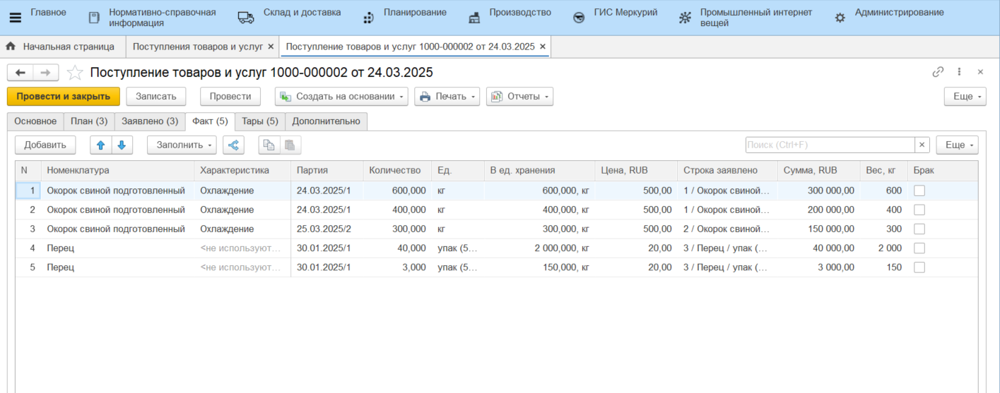

# Приемка сырья и материалов по накладным на ТСД

Приемка перечисленной продукции проводится оператором на ТСД по созданному документу [планового поступления](./CreatePlanOfAccept.md).

Для этого необходимо:

- Зайти в **"Меню учетных точек"**;
- Указать дату планового поступления, смену и рабочий участок, на котором проводится приемка;
- Зайти в кнопку **"Приемка сырья и материалов"** для не адресных складов;

В открывшейся форме будет виден список плановых поступлений. По умолчанию отображаются только те документы, по которым приемка не начата или еще не завершена.

Далее:

- Выбрать документ планового поступления, по которому необходимо принять сырье;
- В открывшейся форме видно список позиций к приемке. Нажать кнопку **"Данные документа"**;
- Заполнить поля **"Номер накладной"** и **"Дата накладной"**, если не были заполнены в документе поступления. Если бы заполнены в документе, то заполнятся автоматически по данным поступления, при необходимости можно изменить вручную;
- Нажать на кнопку **"Подтвердить"**:

Откроется окно с данными о плановом поступлении сырья по документу. Колонка **"План"** заполняется автоматически из документа поступления.

Затем предусмотрено два сценария приемки:

1. Указание заявленных данных вручную;
2. Сканирование этикетки поставщика.

## Указание заявленных и фактических данных вручную

Если нет возможности сканировать этикетку поставщика, есть возможность принять позицию вручную. Для этого:

- Выбрать позицию номенклатуры и нажать кнопку **"Принять"**;
- Откроется окно для заполнения данных о принимаемой позиции по накладной поставщика;
- Ввести заявленное поставщиком количество принимаемой номенклатуры в указанной в плане единице измерения (кг, шт, упаковки и тд), срок годности в днях, дату изготовления и номер партии.
- Затем нажать кнопку **"Приемка"** для перехода к приемке сырья:

Откроется окно для учета данных взвешивания сырья. На форме отображается информация о принимаемой номенклатуре/партии и количестве, которое осталось принять.

Для указания количества фактически принимаемого сырья необходимо:

- Перейти на форму **"Состав"**;
- Нажать **"Указать количество"**;
- Ввести фактическое количество сырья/материала на ОДНОЙ паллете, которая принимается в данный момент;
- Нажать **"Подтвердить"**;
- На форме **"Состав"** будет заполнена информация о количестве сырья на одной паллете. При повторном нажатии на кнопку **"Указать количество"** информация будет отредактирована;
- Кнопка **"Удалить строку"** очищает таблицу "Состав".

По кнопке **"Назад"** нужно вернуться на основную форму и нажать кнопку **"Завершить"**. Созданный упаковочный лист будет отправлен на принтер.

## Сканирование этикетки поставщика

В системе предусмотрено сканирование этикетки поставщика с типом GS1-128. По отсканированной этикетке распознается дата выпуска партии и номер партии, а также вес одного короба/упаковки.

Для перехода к приемке нужно на основной форме отсканировать этикетку поставщика, тогда автоматически определится номенклатура поступления и осуществится переход к форме ввода заявленных данных партии. Дата выпуска и номер партии заполнятся из этикетки, вручную нужно указать заявленный вес партии и срок годности в днях, затем нажать **"Приемка"**:

Автоматически существится переход на форму сканирования. При этом вес отсканированной ранее упаковки уже будет засчитан в качестве факта сканирования:

Далее также предусмотрено два сценария:

1. Приемка упаковок, уникальных по номеру или весу;
2. Приемка одинаковых упаковок.

### Приемка уникальных упаковок

Если упаковки отличаются (весовая продукция, нумерованные упаковки (21 идентификатор)), тогда нужно отсканировать штрихкод каждой упаковки:

На форме **"Состав"** будет заполнена информация о количестве сырья на одной паллете. Кнопка **"Указать количество"** при этом недоступна.

Затем нажать кнопку **"Завершить"**. Созданный упаковочный лист будет отправлен на принтер.

### Приемка одинаковых упаковок

Если упаковки ничем не отличаются, для того, чтобы не сканировать каждую, можно указать общее количество принимаемых упаковок.

Для этого:

- Перейти на форму **"Состав"**;
- Нажать **"Указать количество"**;
- Ввести фактическое количество упаковок сырья/материала на ОДНОЙ паллете, которая принимается в данный момент;
- Нажать **"Подтвердить"**;
- На форме **"Состав"** будет заполнена информация о количестве сырья на одной паллете. При повторном нажатии на кнопку **"Указать количество"** информация будет отредактирована;
- Кнопка **"Удалить строку"** очищает таблицу "Состав".

По кнопке **"Назад"** нужно вернуться на основную форму и нажать кнопку **"Завершить"**. Созданный упаковочный лист будет отправлен на принтер.

## Работа с партиями и паллетами

В обоих сценариях после завершения приемки паллеты осуществляется переход на форму списка партий выбранной номенклатуры. Для того, чтобы продолжить принимать паллеты уже заявленной партии, нужно нажать кнопку **"Продолжить партию"**. 

Осуществится переход на форму списка паллет выбранной партии. Для добавления новой паллеты нужно нажать **"Добавить"** и затем ввести вес новой паллеты или воспользоваться сканированием.

На форме списка паллет можно удалить строку с паллетой, если она неверная:

Для того, чтобы начать приемку другой партии этой же номенклатуры, нужно нажать кнопку **"Добавить партию"**, тогда пользователь будет перенаправлен на форму ввода (или сканирования) заявленных показателей и затем на приемку.

На форме списка партий можно удалить партию целиком:

Для возврата на форму документа планового поступления нужно нажать кнопку **"Назад"**. Результат приемки будет видно на форме:

По кнопке **"Принять"** можно вернуться к работе с выбранной номенклатурой документа поступления.

Когда выполнена приемка всего поступления, нужно нажать кнопку **"Завершить"**. Если в соглашении с контрагентом настроено формирование акта расхождений при приемке, система предложит сформировать документ:

Документ **"Поступление товаров и услуг"** уйдет из списка документов к приемке на ТСД, будет заполнен и переведен в статус **"Принято"**. Остаток сырья и материалов появится на складе.

Строки товаров на странице *"Факт"* разбиваются в соответствии с принятыми паллетами на странице *"Тары"*:

В [настройках учетной точки](SettingsKUT.md) было включено формирование перемещения, поэтому дополнительно на каждую принятую позицию было сформировано **"Распоряжение на перемещение"** с типом *"Перемещение"*:

## Акты расхождений

Если в результате приемки по накладным выявлены расхождения между заявленными суммами и фактическими, то система предлагает создать документ **Акт расхождений**. Этот документ позволяет выявить и зафиксировать несоответствия, что является важным шагом в процессе контроля качества поставок и финансового учета.

Сформированный акт расхождений включает следующие данные:

- Поставщик;
- Склад приемки;
- Документ, на основании которого создан акт;
- Таблица соответствия заявленных и фактических количеств и сумм.

Печатные формы для Акта расхождений формируются по кнопке **"Печать"**:

Акт расхождений может быть представлен в двух **печатных формах**:

- "Акт расхождений"

- Унифицированная форма ТОРГ-2 - стандартная форма, используемая для оформления актов расхождений в соответствии с требованиями законодательства

    [Пример формы ТОРГ-2](https://disk.360.yandex.ru/i/Vma7PVGqpJMW8A){target="_blank"}
